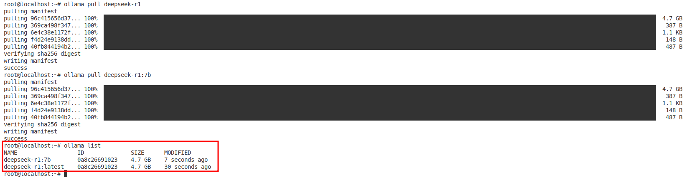

<div style="text-align: center;">

МІНІСТЕРСТВО ОСВІТИ І НАУКИ УКРАЇНИ

НАЦІОНАЛЬНИЙ УНІВЕРСИТЕТ "ЛЬВІВСЬКА ПОЛІТЕХНІКА"

</div>

<br/>
<br/>
<br/>
<br/>

# <div style="text-align: center;">РОЗГОРТАННЯ ПРЕ-ТРЕНОВАНОЇ МОДЕЛІ КЛАССУ GPT В ЛОКАЛЬНОМУ СЕРЕДОВИЩІ</div>

<br/>
<br/>

## <div style="text-align: center;">МЕТОДИЧНІ ВКАЗІВКИ</div>
### <div style="text-align: center;">до виконання лабораторної роботи № 2 <br/> з дисципліни «Штучний інтелект в ігрових застосунках» <br/> для студентів бакалаврського рівня вищої освіти спеціальності 121 "Інженерія програмного забезпечення"</div>

<br/>
<br/>
<br/>
<br/>
<br/>
<br/>
<br/>
<br/>
<br/>
<br/>
<br/>
<br/>
<br/>
<br/>

### <p style="text-align: center;">Львів -- 2025</p>

<div style="page-break-after: always;"></div>

**Розгортання пре-тренованої моделі GPT в локальному середовищі**: методичні вказівки до виконання лабораторної роботи №2 з дисципліни "Штучний інтелект в ігрових застосунках" для студентів першого (бакалаврського) рівня вищої освіти спеціальності 121 "Інженерія програмного забезпечення" . Укл.: О.Є. Бауск. -- Львів: Видавництво Національного університету "Львівська політехніка", 2025. -- 10 с.

<br/>
<br/>
<br/>
<br/>

&nbsp;&nbsp;&nbsp;&nbsp;&nbsp;&nbsp;**Укладач**: Бауск О.Є., к.т.н., асистент кафедри ПЗ

<br/>
<br/>

&nbsp;&nbsp;&nbsp;&nbsp;&nbsp;&nbsp;**Відповідальний за випуск**: Федасюк Д.В., доктор техн. наук, професор

<br/>
<br/>

&nbsp;&nbsp;&nbsp;&nbsp;&nbsp;&nbsp;**Рецензенти**: Федасюк Д.В., доктор техн. наук, професор

&nbsp;&nbsp;&nbsp;&nbsp;&nbsp;&nbsp;&nbsp;&nbsp;&nbsp;&nbsp;&nbsp;&nbsp;&nbsp;&nbsp;&nbsp;&nbsp;&nbsp;&nbsp;&nbsp;&nbsp;&nbsp;&nbsp;&nbsp;&nbsp;&nbsp;&nbsp;&nbsp;&nbsp;&nbsp;&nbsp; Задорожний І.М., асистент кафедри ПЗ

<div style="page-break-after: always;"></div>

**Тема роботи**: Розгортання попередньо тренуваної моделі GPT в локальному середовищі.

**Мета роботи**: Ознайомитись з основами функціонування системи-обгортки для моделей глибокого навчання OLLAMA, навчитися розгортати навчені моделі.

## <div style="text-align: center;">Теоретичні відомості</div>

### Висновок

Сучасні інструменти для розробки систем штучного інтелекту дозволяють розгортати навчені моделі в локальному середовищі. В даній работі демонструється, як швидко і ефективно це зробити використовуючи тільки базові інструменти у відкритому доступі.

## <div style="text-align: center;">Хід роботи</div>

### 1. Налаштування інструменту розгортання моделей машинного навчання Ollama.

1.1. Залежно від системи, на якій проводиться розгортання, встановити інструмент залежно від інструкцій на офіційному сайті: [https://ollama.ai/](https://ollama.ai/).

На Windows:

```
https://ollama.com/download/windows
```

На Linux:
```bash
curl -fsSL https://ollama.com/install.sh | sh
```

1.2. Перевірити інсталяцію:

```bash
ollama --version
```

Має вивести встановлену версію системи розгортання моделей без помилок.

### 2. Встановлення модели LLM

Для задач даної лабораторної роботи ми хочемо використовувати локально модель натуральної генерації мови, яка виконує приблизно ті базові задачі, що, наприклад, широко відомий ChatGPT-o4-mini.

Зазвичай виконання подібної LLM моделі локально на власній машині практично неможливе, как як вона має міліарди параметрів і потребує вкрай потужного апаратного забезпечення.

Для вирішення цієї проблеми використаємо так звану дистільовану модель DeepSeek-R1 з 1 міліардом параметрів.

**УВАГА! Виконуйте даний етап тільки при наявності стабільного якісного інтернет з'єднання. Перевірте наявність кількох десятків ГБ вільного місця на диску.**

Скачаємо архів з цією моделлю і розгорнемо його локально. В командній строці/терміналі:

```bash
ollama pull deepseek-r1
```

Перевіримо, що модель скачалась і зберігається локально:

```bash
ollama list
```

Ви маєте побачити інформацію про встановлену модель:



### 3. Використання моделі Deepseek.

Запустіть модель локально.

```bash
ollama run deepseek-r1
```

Ви маєте отримати командну строку, в якій можна задавати моделі промпти, спостерігати генерацію процесу формування вектора відповідей, і генерацію тексту моделлю.

**Буде доповнено**

## <div style="text-align: center;">УМОВА ЗАВДАННЯ ДО ЛАБОРАТОРНОЇ РОБОТИ</div>

1. Встановити систему розгортання моделей глибокого навчання Ollama.

2. Розгорнути локально LLM модель DeepSeek-R1 (Варіант з 1B параметрів).

3. Протестувати локальне розгортання моделі.

4. Дослідити налаштування моделей при локальному розгортанні, зрозуміти різницю між використанням онлайн- сервісів з LLM моделями та власного деплоймента.

**Буде доповнено**


## <div style="text-align: center;">ІНДІВІДУАЛЬНІ ВАРІАНТИ ЗАВДАННЯ</div>

Створіти чат з локальною інсталяцією DeepSeek і використати наступні теми для розмови, залежно від номера в списку. Дослідити генерацію тексту моделью. Добитися від моделі

**Буде доповнено**


## <div style="text-align: center;">ЗМІСТ ЗВІТУ</div>

1. Тема та мета роботи
2. Теоретичні відомості
3. Постановка завдання
4. Хід виконання роботи:
   - Скріншоти процесу створення локальної інсталяції
   - Код та пояснення для створення моделі
   - Скріншоти інтерфейсу
5. Результати роботи
6. Висновки

**Буде доповнено**

## <div style="text-align: center;">КОНТРОЛЬНІ ПИТАННЯ</div>

**Буде доповнено**

## <div style="text-align: center;">СПИСОК ЛІТЕРАТУРИ</div>

**Буде доповнено**

