<div style="text-align: center;">

МІНІСТЕРСТВО ОСВІТИ І НАУКИ УКРАЇНИ

НАЦІОНАЛЬНИЙ УНІВЕРСИТЕТ "ЛЬВІВСЬКА ПОЛІТЕХНІКА"

</div>

<br/>
<br/>
<br/>
<br/>

# <div style="text-align: center;">СТВОРЕННЯ ПРОСТОЇ СЦЕНИ ДОПОВНЕНОЇ РЕАЛЬНОСТІ З ВИКОРИСТАННЯМ UNREAL ENGINE 5.5</div>

<br/>
<br/>

## <div style="text-align: center;">МЕТОДИЧНІ ВКАЗІВКИ</div>
### <div style="text-align: center;">до виконання лабораторної роботи № 4 <br/> з дисципліни «Віртуальна реальність» <br/> для студентів бакалаврського рівня вищої освіти спеціальності 121 "Інженерія програмного забезпечення"</div>

<br/>
<br/>
<br/>
<br/>
<br/>
<br/>
<br/>
<br/>
<br/>
<br/>
<br/>
<br/>
<br/>
<br/>

### <p style="text-align: center;">Львів -- 2025</p>

<div style="page-break-after: always;"></div>

**Створення простої сцени доповненої реальності з використанням Unreal Engine 5.5**: методичні вказівки до виконання лабораторної роботи №4 з дисципліни "Віртуальна реальність" для студентів першого (бакалаврського) рівня вищої освіти спеціальності 121 "Інженерія програмного забезпечення" . Укл.: О.Є. Бауск. -- Львів: Видавництво Національного університету "Львівська політехніка", 2025. -- 12 с.

<br/>
<br/>
<br/>
<br/>

&nbsp;&nbsp;&nbsp;&nbsp;&nbsp;&nbsp;**Укладач**: Бауск О.Є., к.т.н., асистент кафедри ПЗ

<br/>
<br/>

&nbsp;&nbsp;&nbsp;&nbsp;&nbsp;&nbsp;**Відповідальний за випуск**: Федасюк Д.В., доктор техн. наук, професор

<br/>
<br/>

&nbsp;&nbsp;&nbsp;&nbsp;&nbsp;&nbsp;**Рецензенти**: Федасюк Д.В., доктор техн. наук, професор

&nbsp;&nbsp;&nbsp;&nbsp;&nbsp;&nbsp;&nbsp;&nbsp;&nbsp;&nbsp;&nbsp;&nbsp;&nbsp;&nbsp;&nbsp;&nbsp;&nbsp;&nbsp;&nbsp;&nbsp;&nbsp;&nbsp;&nbsp;&nbsp;&nbsp;&nbsp;&nbsp;&nbsp;&nbsp;&nbsp; Задорожний І.М., асистент кафедри ПЗ

<div style="page-break-after: always;"></div>

**Тема роботи**: Створення простої сцени доповненої реальності з використанням Unreal Engine 5.5.

**Мета роботи**: Ознайомитись з основами функціонування Unreal Engine 5.5, навчитися використовувати його для створення простих сцен доповненої реальності з інтеграцією Google ARCore.

## <div style="text-align: center;">Теоретичні відомості</div>

### Що таке Unreal Engine?

Unreal Engine — це потужний ігровий рушій з відкритим вихідним кодом, розроблений компанією Epic Games. Він використовується для створення відеоігор, архітектурних візуалізацій, кіно, телебачення, а також додатків віртуальної та доповненої реальності. Unreal Engine 5.5 є найновішою версією рушія, що пропонує революційні технології для створення фотореалістичних візуальних ефектів та інтерактивних середовищ.

Основні особливості Unreal Engine 5.5:

1. **Nanite** — система віртуалізованої геометрії, що дозволяє використовувати надзвичайно деталізовані моделі без втрати продуктивності.
2. **Lumen** — система глобального освітлення в реальному часі, що забезпечує динамічне освітлення та відбиття.
3. **Blueprint Visual Scripting** — візуальна система програмування, що дозволяє створювати ігрову логіку без написання коду.
4. **Метасаунд** — потужна система аудіо, що забезпечує процедурний звук.
5. **Підтримка AR/VR** — вбудовані інструменти для створення додатків віртуальної та доповненої реальності.

### Інструменти доповненої реальності в Unreal Engine

Unreal Engine надає потужні інструменти для створення AR-додатків.

- Підтримка різних AR-платформ (ARKit, ARCore, HoloLens)
- Інструменти для відстеження руху та позиціонування об'єктів
- Можливість створення інтерактивних AR-сцен
- Високоякісна візуалізація 3D-об'єктів у реальному світі

**В рамках даної лабораторної роботи ми використаємо базові інструменти доповненої реальності Unreal Engine. Насамперед, ми не будемо використовувати готові темплейти редактора, а прослідкуємо на конкретному прикладі, як зібрати AR сцену з базових блоків редактора.**

### Google ARCore та інтеграція з Unreal Engine

Google ARCore — це платформа для створення додатків доповненої реальності, розроблена Google. Вона дозволяє мобільним пристроям "розуміти" навколишнє середовище та взаємодіяти з інформацією.

Основні можливості ARCore:

1. **Відстеження руху (Motion Tracking)** — дозволяє пристрою розуміти та відстежувати своє положення відносно світу.
2. **Розуміння навколишнього середовища (Environmental Understanding)** — дозволяє пристрою виявляти розмір та розташування горизонтальних та вертикальних поверхонь.
3. **Оцінка освітлення (Light Estimation)** — дозволяє пристрою оцінювати поточні умови освітлення навколишнього середовища.
4. **Прив'язка до зображень (Image Anchors)** — дозволяє розпізнавати та відстежувати зображення.
5. **Спільний досвід (Shared Experiences)** — дозволяє створювати багатокористувацькі AR-додатки.

Інтеграція ARCore з Unreal Engine здійснюється через плагін Google ARCore, який надає доступ до всіх функцій ARCore безпосередньо в середовищі Unreal Engine. Це дозволяє розробникам створювати високоякісні AR-додатки, використовуючи потужні інструменти Unreal Engine для візуалізації та інтерактивності.

### Висновок

Unreal Engine 5.5 у поєднанні з Google ARCore надає готову платформу для створення додатків доданої реальності, яку просто та ефективно використовувати, якщо у вас є досвід попередньої роботи з Unreal Engine редактором. Розуміння основних принципів роботи цих технологій є важливим для розробки ефективних та інноваційних AR-рішень.

## <div style="text-align: center;">Хід роботи</div>

### 1. Встановлення Unreal Engine 5.5

#### 1.1. Встановлення Epic Games Launcher

Для найновішого скерування по встановленню Unreal Engine скористайтеся офіційною документацією: https://www.unrealengine.com/en-US/download

Для початку роботи з Unreal Engine необхідно встановити Epic Games Launcher — програму для встановлення та оновлення Unreal Engine.

**Якщо у вас є встановлена та налаштована інша версія Unreal Engine / UE Editor, інструкції до лабораторної роботи можна виконувати в ній. Вкажіть в фінальному звіті, яку саме версію ви використовували.**

1. Перейдіть на офіційний сайт https://www.unrealengine.com/en-US/download
2. Натисніть на кнопку Download Launcher.
3. Завантажте та встановіть Epic Games Launcher.
4. Створіть обліковий запис Epic Games або увійдіть у існуючий.

#### 1.2. Встановлення Unreal Engine 5.5

Після встановлення Epic Games Launcher:

1. Запустіть Epic Games Launcher.
2. Перейдіть на вкладку "Unreal Engine".
3. Натисніть на кнопку "Бібліотека" у лівому меню.
4. Натисніть на кнопку "+" поруч з "Версії рушія".
5. Виберіть "Unreal Engine 5.5" зі списку доступних версій. Також протестоване використання версії 5.4.
6. Натисніть "Встановити".

**Системні вимоги для Unreal Engine 5.5:**

#### 1.3. Встановлення для різних платформ

**Windows:**
- Завантажте та встановіть Epic Games Launcher з офіційного сайту.
- Слідуйте інструкціям з пункту 1.2.

**macOS:**
- Завантажте та встановіть Epic Games Launcher з офіційного сайту.
- Слідуйте інструкціям з пункту 1.2.
- Зверніть увагу, що для Mac з Apple Silicon (M1, M2) може знадобитися Rosetta 2 (а може і ні, бажано щоб у вас просто вже був налаштований Unreal Engine).

**Linux:**
- Використайте zip архів за посиланням на офіційному сайті https://dev.epicgames.com/documentation/en-us/unreal-engine/linux-development-quickstart-for-unreal-engine
- Запустіть `Engine/Binaries/Linux/UnrealEditor` 

### 2. Створення нового AR-проекту

#### 2.1. Запуск Unreal Engine та створення проекту

1. Запустіть Epic Games Launcher.
2. Перейдіть на вкладку "Unreal Engine".
3. Натисніть на кнопку "Запустити" поруч з Unreal Engine 5.5.
4. У вікні "Новий проект" виберіть вкладку "Games".
5. Виберіть шаблон "Blank" (Порожній проект).
6. Встановіть наступні налаштування:
   - **Тип проекту**: Blueprint
   - **Цільова платформа**: Mobile
   - **Якість графіки**: Scalable
   - **Включити стартовий контент**: Ні
7. Виберіть місце для збереження проекту та введіть його назву (наприклад, "ARSimpleScene").
8. Натисніть "Створити проект".

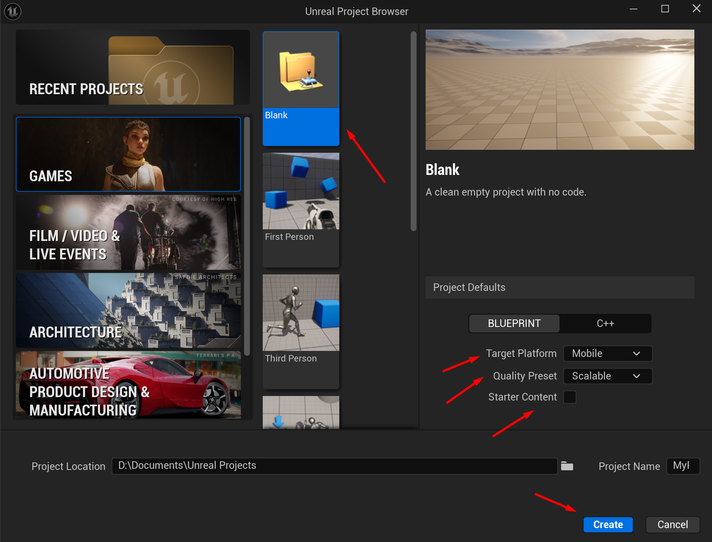

#### 2.2. Налаштування проекту для AR


1. Створіть новий рівень (оберіть порожній рівень, як на малюнку) і збережіть його під назвою "Main".

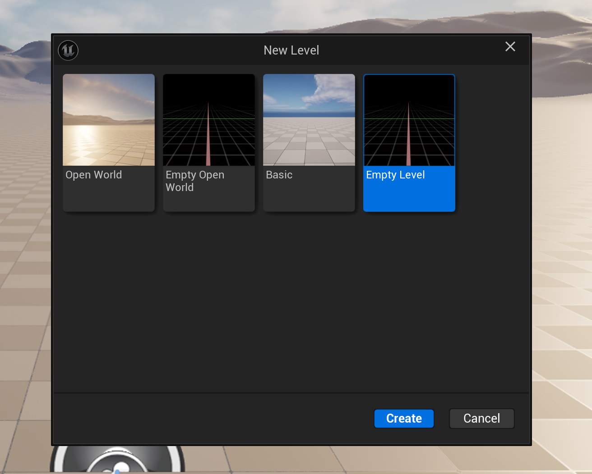

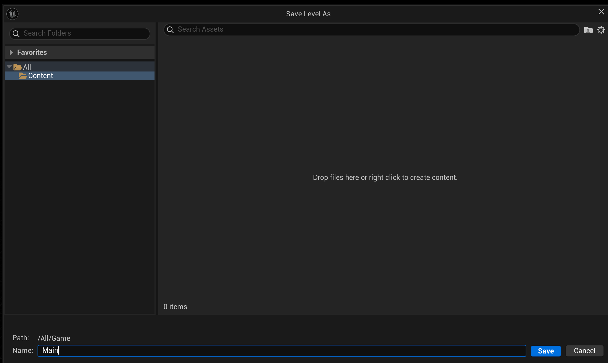

2. Створіть на рівні базову фігуру відповідно до вашого варіанту завдання (див. варіанти нижче) і розмістіть її в точці початку координат (0,0,0).

**В якості необов'язкового, але корисного завдання: імпортуйте і розмістіть в точці початку координат вашу власну модель, якщо вона є у вас в наявності**

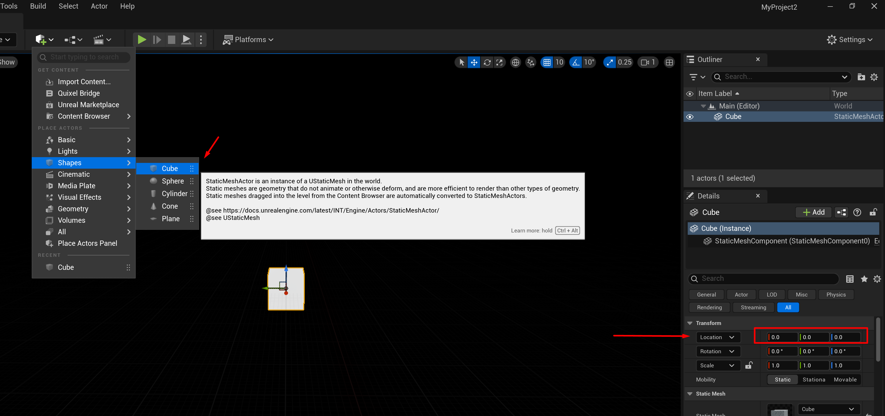

3. Перейдіть до меню "Edit" > "Project Settings".  Встановіть в Maps and Modes рівень Main як Editor Starup Map and Game Default Map.

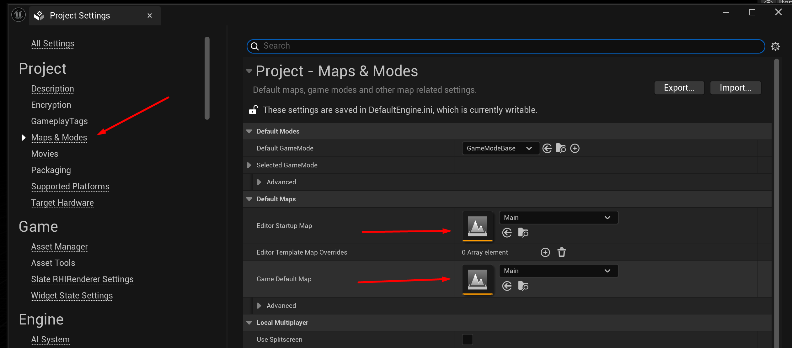

4. Правим кліком у Content Drawer відкрийте контекстне меню і створіть новий Blueprint Class типа Pawn з назвою ARPawn, це буде наша точка входу в AR сцену.


5. Подвійним кліком на створеному ARPawn відкрийте цей об'єкт та створіть в ньому нову звичайну камеру.

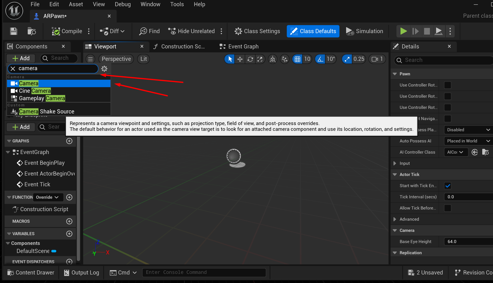

6. Зробіть компіляцію актора ARPawn: у його робочому вікні натисніть Compile. Збережіть зміни.

7. Поверніться в Content Drawer, створіть Blueprint Class -> Game Mode Base з іменем ARGameMode.
Відкрийте його, налаштуйте Default Pawn Class: ARPawn. Скомпілюйте, збережіть зміни.

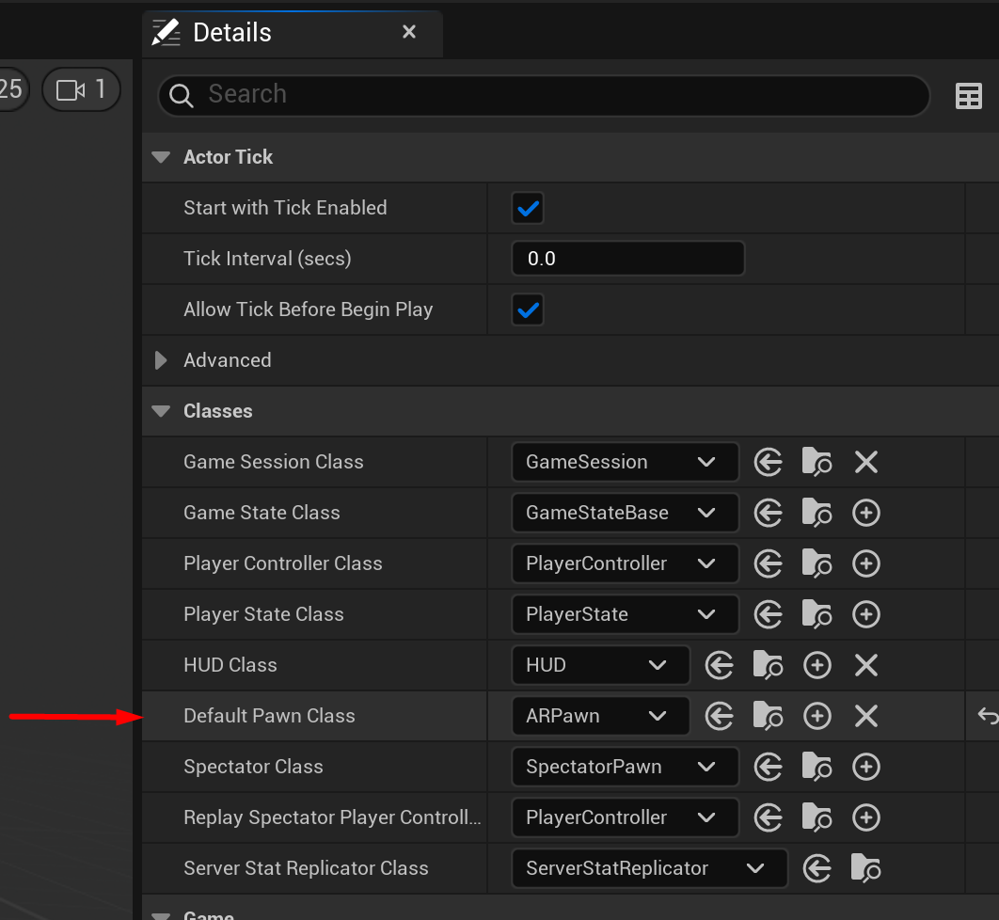

8. В Edit->Project Settings виставте DefaultGameMode: ARGameMode. Переконайтесь також, що Selected GameMode -> Default Pawn Class рівен ARPawn.

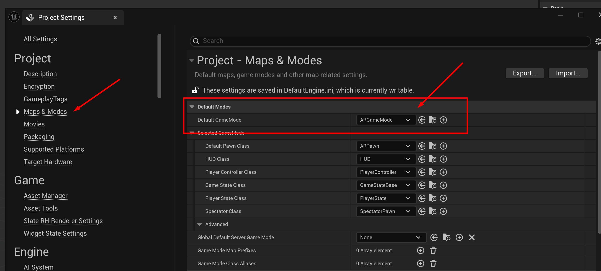

9. Налаштуйте AR Session Config. Додайте плагіни в Edit -> Plugins та перезапустіть редактор:

- AR Utilities;
- Google ARCore.


10. Тепер у нас є доступ з Content Drawer до Miscellaneous -> Data Asset -> ARSession config, додайте його в проект як ARSessionConfig.

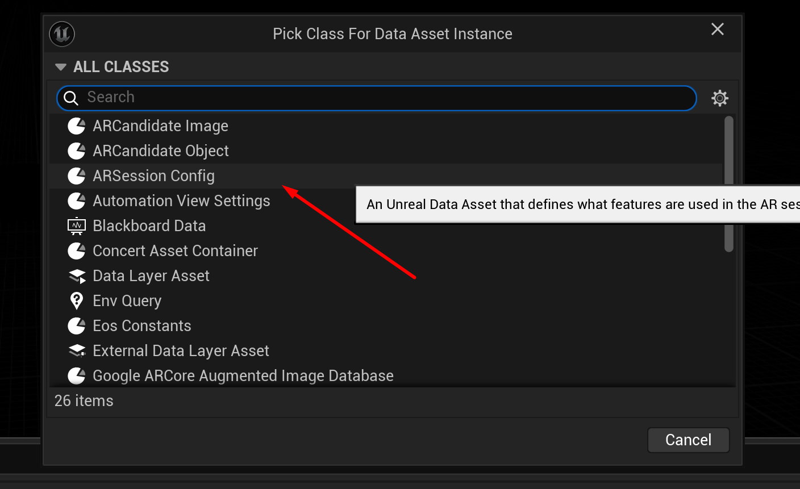

11. Зайдіть в ARPawn та налаштуйте евенти в Event Graph так щоб BeginPlay, EndPlay вказували на Start, Stop AR Session **з вибраним ARSessionConfig**, як на скріншоті. Скомпілюйте.

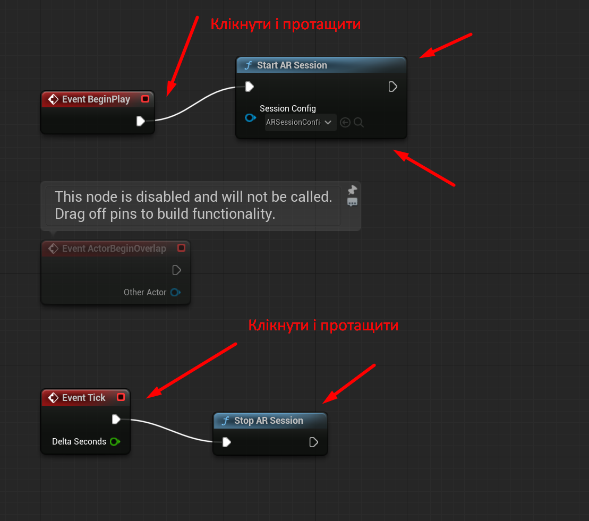

12. Згідно з AR документацією Unreal Engine на цьому етапі у нас є працюючий проект, однак наспраді треба зробити ще деякі налаштування.

13. Edit -> Project Settings, вимкніть підтримку vulkan в Android та вимкніть елементи тач-керування на мобільній платформі.

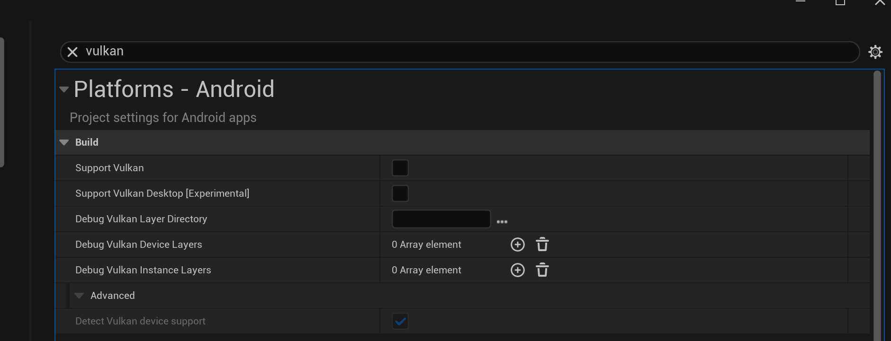

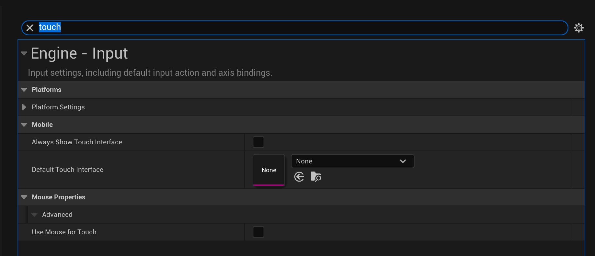

14. Додайте матеріал до вашого 3Д-елементу. В Content Drawer додайте матеріал (правий клік миші -> обрати Material), відкрийте його, виставте режим Shading Model: Unlit, додайте елемент Constant3DVector з параметрами 1.0, 1.0, 1.0 та доєднайте його
до параметру Emissive Color, як на малюнку.

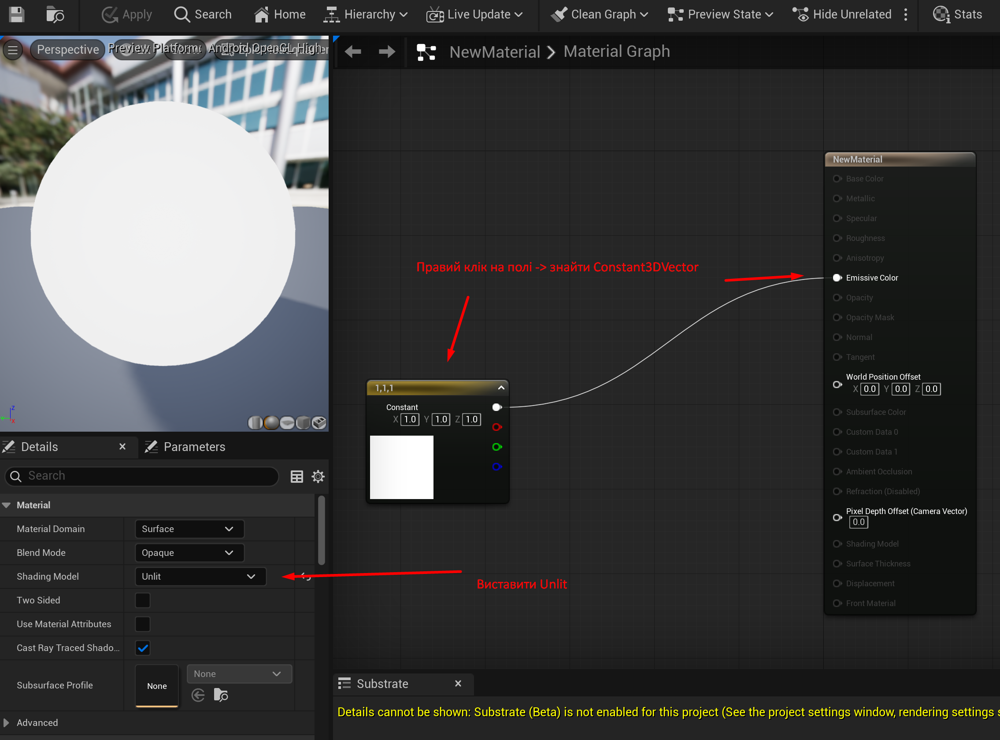

Далі в основній вкладці проекту Main перетащіть мишкою створений матеріал на ваш 3Д-елемент, що додасть до його властивостей цей матеріал.

15. Відкрийте Edit -> Project Settings... та знайдіть опцію Orientation, виставте її в Sensor Portrait.

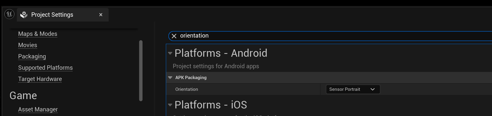


### 2.3 Розгортання проекту на мобільному пристрої Android.

Якщо ваше середовище Unreal не налаштоване для компіляції і розгортання під Android, зробіть налаштування.

2.3.1. В Epic Games Launcher знайдіть в library вашу встановлену версію Engine, відкрийте Options та додайте Target Platforms -> Android і дочекайтесь встановлення компонентів. Перезапустіть Unreal Editor.

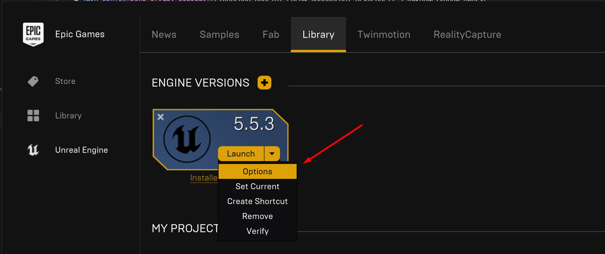

2.3.2. Встановіть правилільну версію Android Studio з наявних релізів за адресою https://developer.android.com/studio/archive

Правільну версію можна дізнатись за документацією до Unreal Engine: https://dev.epicgames.com/documentation/en-us/unreal-engine/android-development-requirements-for-unreal-engine

(можна знайти за пошуковим запитом `unreal Development Requirements`).

**Для нашої версії 5.5 треба встановити версію Koala 2024.1.2 August 29, 2024**

2.3.3. Установіть та налаштуйте Android SDK, Android NDK, Android SDK tools, Java JDK відповідно
до скерувань на цій сторінці:

https://dev.epicgames.com/documentation/en-us/unreal-engine/advanced-setup-and-troubleshooting-guide-for-using-android-sdk

(можна знайти інтернет-пошуком за запитом " Unreal Advanced Android SDK Setup")

Цей етап може бути складним за налаштуванням.

Вам треба після встановлення Android Studio в налаштуваннях Languages and Frameworks -> Android SDK обрати відповідні пакети

- Android SDK Package всі версії від 8 до 34
- Android SDK build-tools 33.0.1, 33.0.3, 34.0.0
- NDK 25.1.893...
- Останню версію Android SDK command-line tools
- CMAKE 3.22.1 and 3.10.2
- Android emulator
- Android SDK platform-tools  

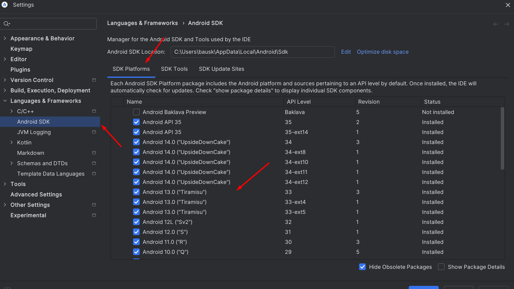

Уважно слідкуйте за інструкцією по посиланню та використовуйте наступне відео в якості керівництва:

https://www.youtube.com/watch?v=08pQikqwmro

Після цього треба обрати відповідні папки в налаштуваннях Unreal Engine -> Edit -> Project Settings -> Platforms -> Android SDK,
як на малюнку внизу (ваші локації файлів будуть відрізнятися через ім'я користувача):

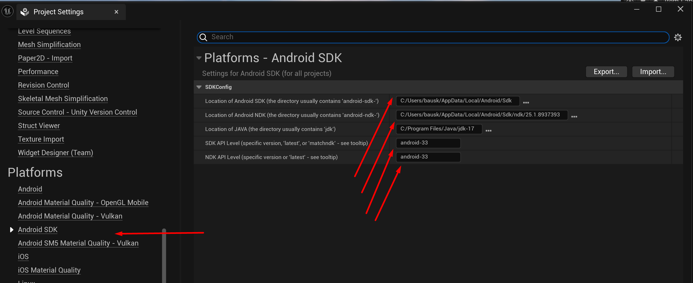

Після цього треба запустити BAT файл автоматичного налаштування залежностей, він знаходиться в

```
Папка встановлення Unreal Engine -> Engine/Extras/Android/SetupAndroid.BAT
```

(або еквівалентний скріпт вашої операційної системи в тій самій папці)

Перезавантажте вашу систему. В результаті ви маєте бачити, що Unreal Engine здатен працювати з платформою Android:

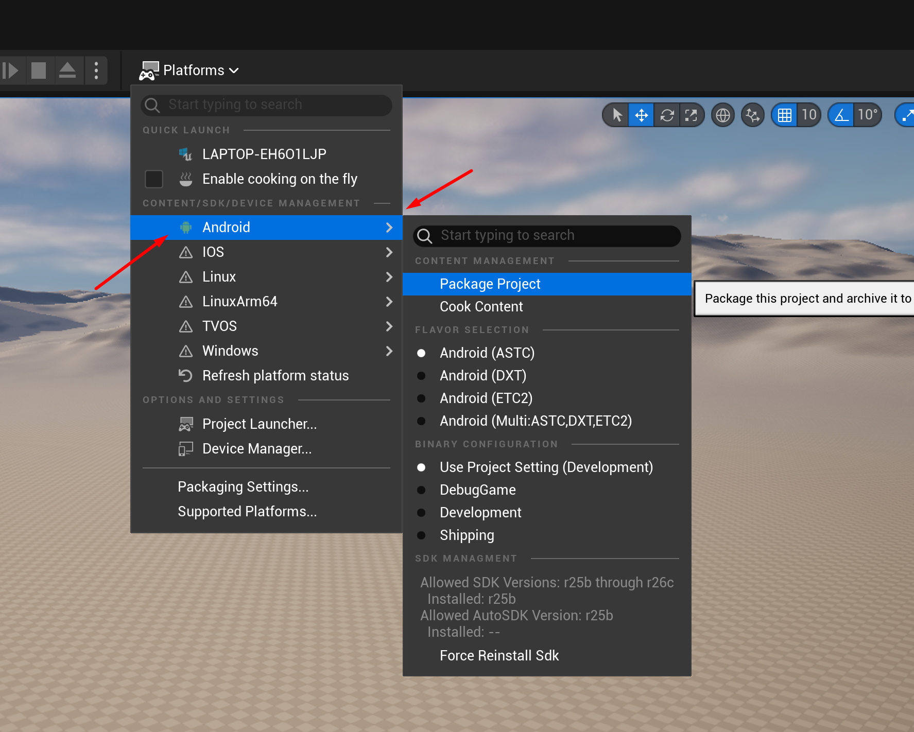


### 3. Встановлення налаштувань проекту для можливості запуску APK додатку.

Необхідно виконати деякі налаштування проекту, щоб забезпечити збірку і функціонування APK пакету без поимлок.

#### 3.1. Усунення проблем з Write permissions to storage

Встановіть наступні параметри в Project Options, щоб система не перевіряла дозволи, які нам не потрібні.

В Extra Permissions додайте два елементи:

- android.permission.READ_EXTERNAL_STORAGE
- android.permission.WRITE_EXTERNAL_STORAGE

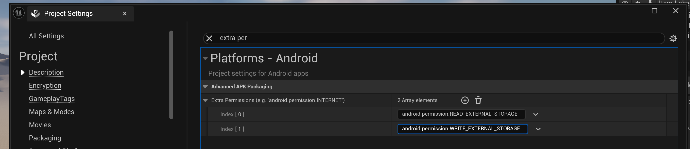

Далі, вимкніть опцію Show launch image -- на цьому етапі робляться попередні перевірки дозволів.


#### 3.2. Усунення проблеми No Google Play Store Key

Ми не маємо цілі публікувати додаток в магазині Google Play, тому прибиремо цю помилку.

В налаштуваннях вкажіть Disable verify OBB on first start/update

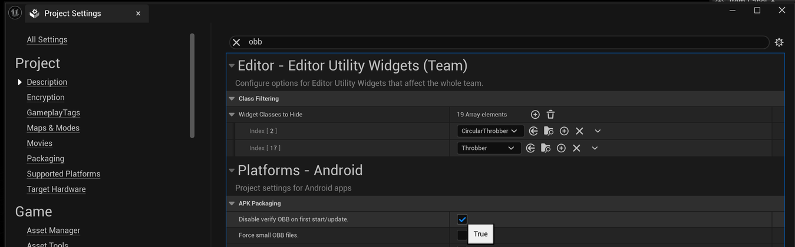


### 4. Компіляція та тестування AR-додатку

#### 4.1. Налаштування Android-пристрою

1. Переконайтеся, що ваш Android-пристрій підтримує ARCore.
2. Увімкніть режим розробника на пристрої:
   - Перейдіть до "Налаштування" > "Про телефон".
   - Натисніть на "Номер збірки" 7 разів.
   - Поверніться до "Налаштування" та знайдіть "Параметри розробника".
   - Увімкніть "USB-налагодження".

#### 4.2. Компіляція та встановлення додатку

1. У Unreal Engine перейдіть до меню  "Platforms" > "Android" > "Package Project".
2. Виберіть папку для збереження APK-файлу.
3. Дочекайтеся завершення компіляції.
4. Встановіть зібраний APK на пристрої Android: зайдіть в папку з білдом, переконайтесь, що підключений Android пристрій
в режимі дебаггінгу через кабель, що підтримує передачу даних, та запустіть BAT файл інсталяції. При необхідності після демонстрації 
роботи запустіть BAT файл деінсталятора.

#### 4.3. Тестування додатку

**УВАГА!** В наявному стані інструкцій до виконання лабораторної работи камера на пристрої не буде рухатись разом з пристроєм.

Для виконання роботи достатньо бути здатним запустити програму на мобільному пристрої без помилок.

1. Запустіть додаток на пристрої.
2. Простежте за відмалюванням створеного вами в додатку 3Д-елемента.

## <div style="text-align: center;">УМОВА ЗАВДАННЯ ДО ЛАБОРАТОРНОЇ РОБОТИ</div>

1. Встановити Unreal Engine 5.5 або 5.4 та налаштувати його для розробки AR-додатків.

2. Створити простий AR-додаток, що дозволяє розміщувати 3D-фігуру у реальному просторі.

3. Протестувати додаток на реальному Android-пристрої з підтримкою ARCore.

4. Зробити скріншоти ходу виконання роботи, використаних класів та інших елементів Unreal Editor, скріншоти роботи додатку.

## <div style="text-align: center;">ІНДІВІДУАЛЬНІ ВАРІАНТИ ЗАВДАННЯ</div>

Використати параметри AR-сцени в залежності від імені та прізвища автора звіту:

Параметр A = Номер в алфавіті першої літери вашого імені + номер в алфавіті першої літери вашого прізвища

1. Розмірні параметри елемента: (A/15, A/20, A/25). Використовувати всі три розміри для куба, перший розмір для кулі.
2. Колір куба: Червоний якщо A // 3 = 0, синій якщо
3. Тип елемента: куб для А > 20, куля для А <= 20 ()

## <div style="text-align: center;">ЗМІСТ ЗВІТУ</div>

1. Тема та мета роботи
2. Теоретичні відомості
3. Постановка завдання
4. Хід виконання роботи:
   - Скріншоти процесу встановлення Unreal Engine за необхідності
   - Скріншоти створення та налаштування AR-проекту
   - Скріншоти реалізації AR-сцени з 3D-фігурою
   - Скріншоти роботи додатку на реальному пристрої
5. Результати роботи відповідно до індивідуального варіанту
6. Висновки

## <div style="text-align: center;">КОНТРОЛЬНІ ПИТАННЯ</div>

1. Що таке Unreal Engine та які його основні можливості для розробки AR-додатків?
2. Що таке ARCore та як він інтегрується з Unreal Engine?
3. Які основні компоненти AR-сесії в Unreal Engine?
4. Як реалізується взаємодія користувача з AR-об'єктами в Unreal Engine?
5. Які переваги та недоліки використання Unreal Engine для розробки AR-додатків порівняно з іншими платформами, наприклад з прямою розробкою для WebXR, яку ви робили в минулих лабораторних роботах?
6. Які основні етапи розробки AR-додатку в Unreal Engine?

## <div style="text-align: center;">СПИСОК ЛІТЕРАТУРИ</div>

1. Офіційна документація Unreal Engine: https://docs.unrealengine.com/

2. Документація Google ARCore: https://developers.google.com/ar

3. Unreal Engine AR Development: https://dev.epicgames.com/documentation/en-us/unreal-engine/augmented-reality-overview-in-unreal-engine?application_version=5.5

4. Epic Games Learning Portal: https://dev.epicgames.com/community/learning

5. Unreal Engine Forums: https://forums.unrealengine.com/

6. Advanced Android SDK setup: https://dev.epicgames.com/documentation/en-us/unreal-engine/advanced-setup-and-troubleshooting-guide-for-using-android-sdk

7. UE 5.5 Android step by step setup guide: https://www.youtube.com/watch?v=mZ0yHY3X6OQ

8. JDK 17 Downloads: https://www.oracle.com/java/technologies/javase/jdk17-archive-downloads.html