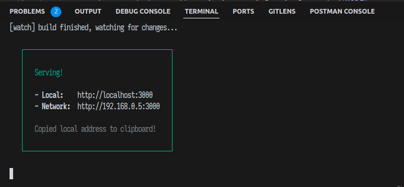
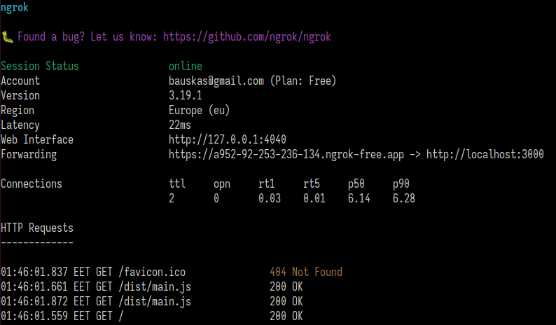
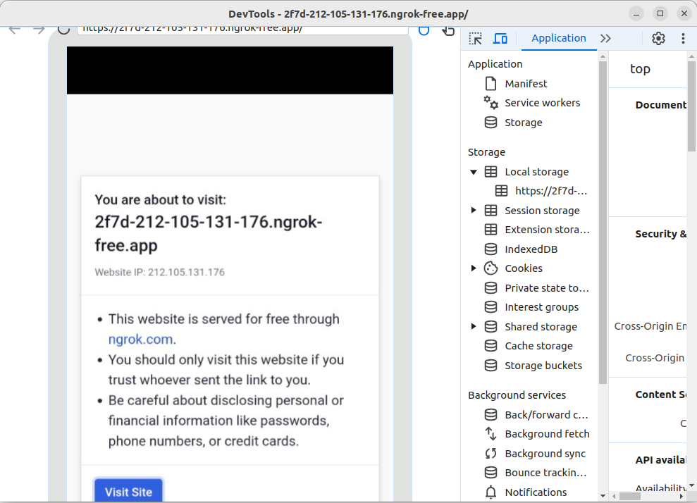

<div style="text-align: center;">

МІНІСТЕРСТВО ОСВІТИ І НАУКИ УКРАЇНИ

НАЦІОНАЛЬНИЙ УНІВЕРСИТЕТ ЛЬВІВСЬКА ПОЛІТЕХНІКА

КАФЕДРА ПРОГРАМНОЇ ІНЖЕНЕРІЇ

</div>

## <p style="text-align: center;">МЕТОДИЧНІ ВКАЗІВКИ</p>
### <p style="text-align: center;">до лабораторної роботи № 1 з дисципліни «Віртуальна реальність»<br/>для студентів напряму підготовки “Інженерія програмного забезпечення”</p>
<br/>
<br/>
<br/>
<br/>
<br/>
<br/>
<br/>
<br/>
<br/>
<br/>
<br/>
<br/>
<br/>
<br/>

### <p style="text-align: center;">Львів 2025</p>

<div style="page-break-after: always;"></div>

## Завдання

Налаштувати WebXR середовище для роботи з веб API доповненої реальністі.

## 1. Необхідні інструменти розробки

1.1. Установити середовище розробки Cursor: [https://www.cursor.com/](https://www.cursor.com/)

1.2. Для управління версіями Node.js -- Установити NVM: [https://github.com/nvm-sh/nvm](https://github.com/nvm-sh/nvm)

1.2.1 Версія Node.js для виконання лабораторних робіт - LTS 22.13.1.

1.2.2 У випадку проблеми зі зміною версії Node.js за допомогою NVM, наприклад неможливості перейти з system на LTS, реініцалізацію можна виконати наступним чином:

```bash
nvm deactivate && nvm unload && source ~/.nvm/nvm.sh && nvm use --lts
```

1.3. Установити Node.js, останню LTS версію, за допомогою NVM.

```bash
nvm install --lts
nvm use --lts
```

1.4. Для управління Node.js залежностями в проекті -- Установити PNPM: [https://www.npmjs.com/get-npm](https://www.npmjs.com/get-npm)

1.4.1. Варіант 1. Викорстовувати corepack для встановлення PNPM.
```bash
npm install --global corepack@latest
corepack enable pnpm
```

1.4.2. Варіант 2. Викорстовувати npm для встановлення PNPM.
```bash
npm install -g pnpm
```

1.5. Для створення HTTPS ендпойнту онлайн -- зареєструватись в сервісі ngrok та встановити ngrok CLI: [https://ngrok.com/](https://ngrok.com/)

```bash
curl -sSL https://ngrok-agent.s3.amazonaws.com/ngrok.asc \
	| sudo tee /etc/apt/trusted.gpg.d/ngrok.asc >/dev/null \
	&& echo "deb https://ngrok-agent.s3.amazonaws.com buster main" \
	| sudo tee /etc/apt/sources.list.d/ngrok.list \
	&& sudo apt update \
	&& sudo apt install ngrok

ngrok config add-authtoken <YOUR_AUTH_TOKEN>
# Test ngrok
ngrok http localhost:3000
```

1.6 Склонувати локально цей репозиторій і відкрити в Cursor перше завдання ЛР-01-01 `ar-practice-2025/lab-2025-01-01`.

## 2. Нотатки до виконання.

2.1. NVM - Node Version Manager, підсистема для управління версіями Node.js. NVM необхідно для того, щоб можна було легко перемикатися між різними версіями Node.js. В рамках цього та інших курсів та лабораторних робіт може виникнути потреба мати доступ до різних версій Node.js. NVM дозволяє легко перемикатися між різними версіями рантайму. Наша робоча версія Node.js в рамках цього курсу - LTS 22.13.1.

2.2. PNPM - це аналог npm, ефективний пакет-менеджер, який використовується для управління залежностями в проектах. PNPM є альтернативою npm, яка має більш швидкі та ефективні алгоритми для керування залежностями. За бажанням можна використовувати інші пакет-менеджери, такі як Yarn, npm, vite тощо, але методичні вказівки та завдання будуть розроблені з урахуванням PNPM.

2.3. Cursor - це IDE, яка інтегрує VSCode та AI, і дозволяє використовувати промпти штучного інтелекту для написання коду. Cursor є альтернативою VSCode, методичні вказівки не роблять особливих вимог до використання Cursor, але він може бути корисним для написання коду. Як альтернатива може використовуватись VSCode.

## 3. Виконання завдання.

### 3.1. Відкрити в Cursor проект `ar-practice-2025/lab-2025-01-01`.
**Ця директорія має бути робочою для наступних команд, якщо не вказано інше.**

### 3.2. Переконатись, що версії інструментів встановлені і відповідають очікуваним. В терміналі виконати команди:

```bash
# Node.js
node --version
# v22.13.1
# У випадку проблеми з версією:
nvm install --lts
nvm use --lts

# PNPM
pnpm --version
# v10.2.1
# У випадку проблеми з версією:
corepack enable pnpm
corepack use pnpm@latest-10
```

### 3.3. Відкрити файл `package.json` і переконатись, що corepack коректно встановив `"packageManager"` та `"devDependencies"->"typescript"`.

### 3.4. Відкрити файл `main.ts` і переконатись, що він не містить помилок.

3.4.1. Перша помилка, яку ви маєте побачити -- це помилка з імпортом Three.js:


Вирішить проблеми з імпортом і типізацією Three.js та WebXR API. Встановіть наступні залежності:

```bash
three@0.172.0
@types/three@0.172.0
@types/webxr
```

### 3.5. Імплементувати скріпти для запуску проекту.

Дослідіть готову конфігурацію білду проекту, який використовує Typescript та `esbuild`, в файлі `tsconfig.json`.

Необхідно імплементувати наступні скрипти для запуску та білду проекту:

```bash
pnpm run start # запуск проекту для розробки з перебудуванням при зміні файлів
pnpm run build # білд проекту
```

Приклад команди, що використовується для білду проекту:

```bash
esbuild main.ts --bundle --outfile=dist/main.js --format=esm
```

Імплементуйте ці дві команди в `package.json`. Для `pnpm runs build` рішення наведене вище, для `pnpm run start` потрібно виконати наступне:

* запустити інсуючу команду esbuild
* додати до неї флаг `--watch` (використовуйте документацію pnpm)
* відправити процес в фоновий режим і використовувати `serve` для запуску сервера в робочій директорії.

Також необхідно інсталювати наступні залежності:

```
esbuild
serve
```

Перевірте, чи працює команда `pnpm run start`. Успішне виконання команди має відкрити локальний сервер на порту 3000:



### 3.6. Використати ngrok для створення HTTPS ендпойнту, доступного з мобільного пристрою.

```bash
ngrok http http://localhost:3000
```

Команда повинна відкрити ендпойнт, який можна буде використовувати для доступу до проекту з мобільного пристрою. Перевірте ендпойнт:



### 3.7. Відкрити ендпойнт в браузері на мобільному пристрої, використовуючи remote debugging в браузері Chrome.

Налаштувати remote debugging відповідно до документації: [https://developer.chrome.com/docs/devtools/remote-debugging/](https://developer.chrome.com/docs/devtools/remote-debugging/)

На машині, на якій відбувається розробка, відкрити `chrome://inspect/#devices` і налаштувати remote debugging відповідно до документації.

Відкрити HTTPS ендпойнт в браузері на мобільному пристрої і переконатись, що remote debugging працює.



### 3.8. Імплементувати створення простого 3D об'єкту в WebXR.

3.8.1. Дослідіть приклад створення простого 3D об'єкту в WebXR в документації.
Задача Лабораторної роботи -- відтворити приклад з документації до розділу "Run Hello WebXR", на який подано посилання нижче.

[https://developers.google.com/ar/develop/webxr/hello-webxr#run_hello_webxr](https://developers.google.com/ar/develop/webxr/hello-webxr#run_hello_webxr)

3.8.2. Відкрийте файл `main.ts`, дослідіть існуючий код. Це непрацюючий шаблон  коду, який треба наповнити імплементацією відповідно до прикладу вище. Зверніть увагу на наступні речі:

* Структура коду інша, ніж у прикладі. Проаналізуйте приклад крок за кроком і використайте відповідні фрагменти в main.ts там, де це потрібно.

* Ваш код використовує Typescript, код з документації потрібно оздобити відповідними типами.

