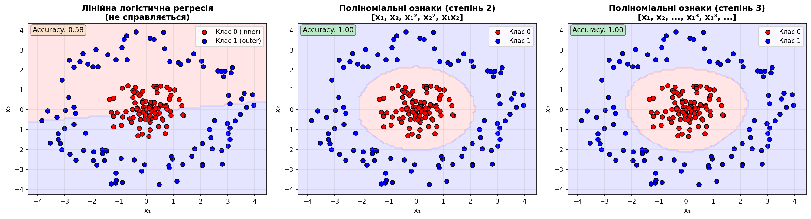
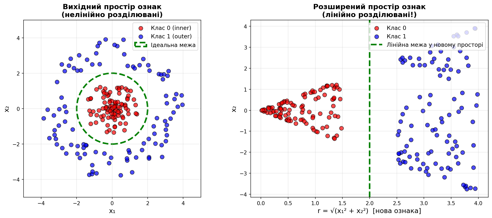
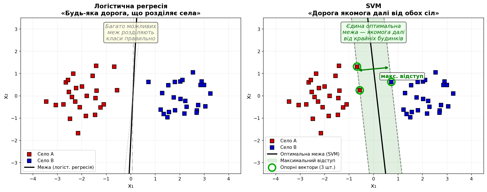
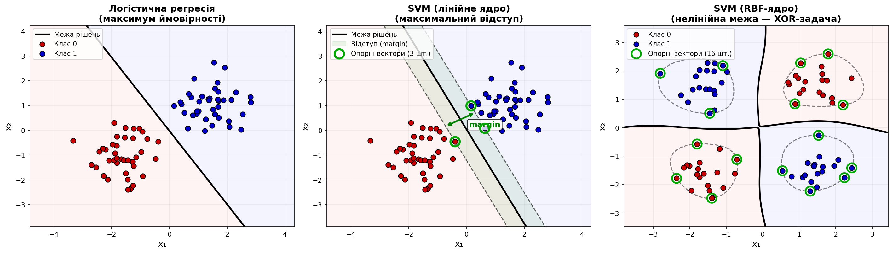

<div style="text-align: center;">

МІНІСТЕРСТВО ОСВІТИ І НАУКИ УКРАЇНИ

НАЦІОНАЛЬНИЙ УНІВЕРСИТЕТ "ЛЬВІВСЬКА ПОЛІТЕХНІКА"

</div>

<br/>
<br/>
<br/>
<br/>

# <div style="text-align: center;">ЛЕКЦІЯ 3. КЛАСИФІКАЦІЯ, МЕТРИКИ ТА ГІПЕРПАРАМЕТРИ</div>

<br/>
<br/>

### <p style="text-align: center;">Львів -- 2026</p>

<script>
MathJax = {
  tex: {
    inlineMath: [['$', '$']],
    displayMath: [['$$', '$$']]
  }
};
</script>
<script src="https://cdn.jsdelivr.net/npm/mathjax@3/es5/tex-chtml.js"></script>

<div style="page-break-after: always;"></div>

# Лекція зі штучного інтелекту 2026-03

## Вступ

На попередній лекції ми вивчили регресію — задачу передбачення неперервних величин — та градієнтний спуск як універсальний механізм оптимізації. Тепер настав час перейти до другої фундаментальної задачі навчання з учителем — **класифікації**.

Класифікація — це задача віднесення об'єкта до одного з наперед визначених класів. Чи піде гравець із гри? Який тип ворога на екрані? До якого жанру належить гра за її описом? Усі ці задачі — класифікація. На відміну від регресії, де ми передбачаємо число, тут ми передбачаємо категорію.

У цій лекції ми вивчимо логістичну регресію, розберемося, як поліноміальні ознаки дозволяють будувати нелінійні межі класифікації, порівняємо логістичну регресію з методом опорних векторів (SVM), та дізнаємося про критично важливі метрики якості класифікації та стратегії підбору гіперпараметрів.

## Теми, що розглядаються

1. Логістична регресія та межі прийняття рішень
2. Нелінійні межі через поліноміальні ознаки
3. Регуляризація: запобігання перенавчанню
4. Порівняння з методом опорних векторів (SVM)
5. Функція втрат крос-ентропія
6. Метрики класифікації: precision, recall, F1-score
7. Стратегії підбору гіперпараметрів
8. Ігрові застосування

<div style="page-break-after: always;"></div>

## Логістична регресія та класифікація

### Від регресії до класифікації

Лінійна регресія передбачає числове значення. Але що, якщо нам потрібно передбачити категорію? Наприклад, чи піде гравець із гри (*churn*: так/ні)? Тоді потрібна **класифікація**.

Ключова ідея **логістичної регресії** — взяти лінійну модель і пропустити її результат через функцію, що перетворює будь-яке число в ймовірність від 0 до 1. Ця функція називається **сигмоїда** (*sigmoid*):

<div>
$$\sigma(z) = \frac{1}{1 + e^{-z}}, \quad \text{де } z = \mathbf{w}^T \mathbf{x} + b$$
</div>

Сигмоїда має характерну S-подібну форму: для дуже від'ємних $z$ вона дає значення близько 0, для дуже додатних — близько 1, а при $z=0$ повертає рівно 0.5.

Результат $\sigma(z)$ інтерпретується як ймовірність належності до позитивного класу. Якщо $\sigma(z) \geq 0.5$ — передбачаємо клас 1, інакше — клас 0.

### Межа прийняття рішень (Decision Boundary)

Логістична регресія фактично шукає лінійну межу (*decision boundary*), яка розділяє простір ознак на два класи. Точки по один бік від межі класифікуються як клас 0, по інший — як клас 1.

**Ігровий приклад.** Уявіть двовимірний простір: вісь X — середній час сесії гравця, вісь Y — кількість внутрішньоігрових покупок. Логістична регресія проведе пряму лінію, що розділить гравців на тих, хто залишиться (зелені точки), і тих, хто піде (червоні точки). Усі точки «вище» прямої — активні гравці, «нижче» — потенційний відтік.

### Нелінійні межі рішень через поліноміальні ознаки

**Обмеження лінійної логістичної регресії:** якщо реальна межа між класами нелінійна (наприклад, дугоподібна або кругова), проста логістична регресія не зможе її точно змоделювати.

**Чи достатньо поліноміальних ознак для нелінійних меж?** Так! Пригадайте трюк із розширення простору ознак з попередньої лекції про регресію. Той самий принцип працює і для класифікації. Якщо у нас є дві ознаки $x_1$ та $x_2$, ми можемо створити нові поліноміальні ознаки:

<div>
$$[x_1, x_2] \rightarrow [x_1, x_2, x_1^2, x_2^2, x_1 x_2]$$
</div>

Тепер логістична регресія у цьому розширеному просторі матиме вигляд:

<div>
$$z = w_1 x_1 + w_2 x_2 + w_3 x_1^2 + w_4 x_2^2 + w_5 x_1 x_2 + b$$
</div>

Це все ще **лінійна** модель відносно параметрів $w_i$, але межа рішень у вихідному двовимірному просторі $(x_1, x_2)$ тепер може бути **криволінійною** — колом, еліпсом, параболою тощо.

**Математична інтуїція:** межа рішень — це множина точок, де $z = 0$. Для лінійної моделі $w_1 x_1 + w_2 x_2 + b = 0$ — це пряма. Для поліноміальної моделі $w_3 x_1^2 + w_4 x_2^2 + \ldots = 0$ — це крива другого порядку (коло, еліпс, гіпербола залежно від коефіцієнтів).

**Візуалізація:** розгляньте задачу класифікації з круговою межею — точки всередині кола належать до одного класу, зовні — до іншого.



**Рисунок 1.** Порівняння логістичної регресії з різними ступенями поліноміальності. **Ліворуч:** лінійна модель (degree=1) не може відокремити класи — пряма лінія не описує кругову межу. **По центру:** поліноміальні ознаки степеня 2 створюють кругову межу, точність різко зростає. **Праворуч:** степінь 3 дає ще гнучкішу межу, але ризикує перенавчанням на цьому простому прикладі.

**Як це працює концептуально?** Поліноміальне розширення **перетворює нелінійно розділювані дані в лінійно розділювані** за рахунок переходу в простір вищої розмірності.



**Рисунок 2.** Ілюстрація концепції трансформації. **Ліворуч:** у вихідному просторі $(x_1, x_2)$ дані нелінійно розділювані — ідеальна межа є колом. **Праворуч:** після додавання нової ознаки $r = \sqrt{x_1^2 + x_2^2}$ (відстань від початку координат), дані стають лінійно розділюваними у новому просторі $(r, x_2)$ — проста вертикальна лінія розділяє класи ідеально.

**Практичні рекомендації:**

1. **Для простих меж** (коло, еліпс, парабола) — достатньо степеня 2
2. **Для складніших меж** — степінь 3 або 4, але обережно з перенавчанням
3. **Для дуже складних меж** — нейронні мережі або SVM з RBF-ядром ефективніші
4. **Обов'язково використовуйте регуляризацію** при високих степенях (детально — у наступному розділі)

**Альтернативні підходи для нелінійних меж:**

- **SVM з ядрами** (RBF, polynomial kernel) — обговорюється далі в цій лекції
- **Нейронні мережі** — наступні лекції курсу
- **Дерева рішень та Random Forest** — природним чином створюють нелінійні межі
- **k-Nearest Neighbors (k-NN)** — нелінійна межа за замовчуванням

**Висновок:** поліноміальні ознаки **достатні** для багатьох нелінійних задач класифікації, особливо коли межа має геометричну форму (коло, еліпс, парабола). Це простий, інтерпретований та ефективний метод. Для більш складних довільних меж краще використовувати SVM з ядрами або нейронні мережі.

<div style="page-break-after: always;"></div>

## Регуляризація: запобігання перенавчанню

### Проблема перенавчання з поліноміальними ознаками

Поліноміальні ознаки — потужний інструмент, але з ним треба бути обережним. Що станеться, якщо ми візьмемо надто високий степінь? Модель отримає забагато параметрів і почне **запам'ятовувати** тренувальні дані замість того, щоб вловити справжню закономірність. Це і є **перенавчання** (*overfitting*).

**Приклад з поліноміальної регресії.** Уявіть, що ви моделюєте шкоду від падіння в грі залежно від висоти $h$. У вас є 10 точок даних від тестерів. Поліном 2-го степеня ($\hat{y} = w_1 h + w_2 h^2 + b$) дає гладку криву, що розумно описує залежність: шкода зростає швидше з висотою. Але поліном 9-го степеня пройде через кожну точку ідеально — і при цьому хаотично коливатиметься між ними, передбачаючи, наприклад, від'ємну шкоду на деяких висотах. Математично це виражається у надто великих значеннях ваг: коефіцієнти $w_i$ стають величезними (тисячі, мільйони), компенсуючи один одного у складних осциляціях.

**Ідея регуляризації** проста: додати до функції втрат штраф за складність моделі. Ми модифікуємо задачу оптимізації:

<div>
$$\mathcal{L}_{reg} = \mathcal{L}_{original} + \lambda \cdot R(\mathbf{w})$$
</div>

де $\mathcal{L}_{original}$ — оригінальна функція втрат (MSE для регресії, крос-ентропія для класифікації), $R(\mathbf{w})$ — **регуляризаційний член**, що штрафує за великі ваги, а $\lambda$ (*lambda*) — **сила регуляризації**, що контролює баланс між точністю на тренувальних даних і простотою моделі.

### L2-регуляризація (Ridge / гребенева регресія)

**L2-регуляризація** штрафує суму квадратів усіх ваг. Для поліноміальної регресії повна функція втрат:

<div>
$$\mathcal{L}_{Ridge} = \underbrace{\frac{1}{N} \sum_{i=1}^{N} (\hat{y}_i - y_i)^2}_{\text{MSE — точність}} + \underbrace{\lambda \sum_{j=1}^{n} w_j^2}_{\text{штраф — простота}}$$
</div>

**Ефект:** L2 робить усі ваги меншими, але не обнуляє жодну повністю. Модель стає «плавнішою» — замість різких осциляцій високого полінома отримуємо гладку криву. В контексті нейронних мереж L2-регуляризацію називають **weight decay** (загасання ваг) — це найпоширеніший метод регуляризації у глибокому навчанні.

**Геометрична інтуїція:** L2 обмежує вектор ваг всередині сфери в просторі параметрів. Оптимальне рішення — точка, де контури функції втрат торкаються цієї сфери.

### L1-регуляризація (Lasso)

**L1-регуляризація** штрафує суму абсолютних значень ваг:

<div>
$$\mathcal{L}_{Lasso} = \frac{1}{N} \sum_{i=1}^{N} (\hat{y}_i - y_i)^2 + \lambda \sum_{j=1}^{n} |w_j|$$
</div>

**Ключова відмінність від L2:** Lasso виробляє **розріджені** (*sparse*) розв'язки — частина ваг стає *точно нулем*. Це фактично є **автоматичним відбором ознак** (*feature selection*).

**Приклад:** маємо поліноміальну регресію степеня 5 із ознаками $[h, h^2, h^3, h^4, h^5]$ для передбачення шкоди від падіння. Якщо справжня залежність квадратична, Lasso при достатньому $\lambda$ «обнулить» ваги при $h^4$ та $h^5$, фактично перетворивши модель 5-го степеня на модель 2-го. Ridge натомість зменшить усі п'ять ваг, але жодну не обнулить.

**Геометрична інтуїція:** L1 обмежує ваги всередині «діаманта» (ромба) в просторі параметрів. Кути діаманта лежать на осях координат, тому оптимальне рішення часто потрапляє на кут — де одна або кілька ваг дорівнюють нулю.

### Порівняння методів регуляризації

| Властивість | L2 (Ridge) | L1 (Lasso) |
|---|---|---|
| Штраф | $\sum w_j^2$ | $\sum \lvert w_j \rvert$ |
| Ефект на ваги | Зменшує, не обнуляє | Обнуляє частину (розрідженість) |
| Відбір ознак | Ні | Так, автоматичний |
| Геометрія обмеження | Сфера | Діамант (ромб) |
| Типове застосування | За замовчуванням; weight decay | Коли потрібен відбір ознак |

**Elastic Net** поєднує обидва підходи: $R_{EN}(\mathbf{w}) = \alpha \lVert\mathbf{w}\rVert_1 + (1 - \alpha) \lVert\mathbf{w}\rVert_2^2$ і корисний, коли є багато корельованих ознак — він відбирає групи пов'язаних ознак разом.

### Регуляризація в логістичній регресії

Той самий принцип працює і для класифікації. Для логістичної регресії додаємо регуляризаційний член до крос-ентропії:

<div>
$$\mathcal{L}_{reg} = -\frac{1}{N} \sum_{i=1}^{N} \Big[ y_i \log(\hat{y}_i) + (1 - y_i) \log(1 - \hat{y}_i) \Big] + \lambda \|\mathbf{w}\|_2^2$$
</div>

Це особливо критично при використанні поліноміальних ознак для нелінійної класифікації: без регуляризації модель з ознаками степеня 4–5 побудує надто складну межу, що обходить кожну тренувальну точку, але погано працює на нових даних.

**Практичний приклад (scikit-learn).** У бібліотеці scikit-learn сила регуляризації задається параметром $C = 1/\lambda$ — тобто **менше C** означає **сильнішу** регуляризацію:

```python
from sklearn.linear_model import LogisticRegression

# Сильна регуляризація → простіша межа рішень
model = LogisticRegression(C=0.01, penalty='l2')

# Слабка регуляризація → складніша межа рішень
model = LogisticRegression(C=100, penalty='l2')

# L1-регуляризація → автоматичний відбір ознак
model = LogisticRegression(C=1.0, penalty='l1', solver='liblinear')
```

### Вибір сили регуляризації

Параметр $\lambda$ — це гіперпараметр, що підбирається через крос-валідацію:

- **$\lambda \to 0$** — немає регуляризації — ризик перенавчання (модель запам'ятовує шум)
- **$\lambda \to \infty$** — усі ваги наближаються до нуля — недонавчання (модель нічого не вивчила)
- **Оптимальне $\lambda$** — баланс між складністю та здатністю до узагальнення

Типовий підхід: перебрати значення $\lambda$ на логарифмічній шкалі ($10^{-4}, 10^{-3}, 10^{-2}, 10^{-1}, 1, 10$) і обрати те, що дає найкращу якість на валідаційному наборі. Ми розглянемо стратегії підбору гіперпараметрів детальніше у розділі про Grid Search та Random Search далі в цій лекції.

<div style="page-break-after: always;"></div>

### Порівняння з методом опорних векторів (SVM)

Логістична регресія — не єдиний метод лінійної класифікації. **Метод опорних векторів** (*Support Vector Machine*, SVM) розв'язує ту саму задачу — знаходить межу між класами — але з іншою філософією.

Логістична регресія шукає межу, яка максимізує ймовірність правильної класифікації всіх прикладів. SVM шукає межу з **максимальним відступом** (*margin*) — тобто таку, що знаходиться якомога далі від найближчих точок обох класів. Ці найближчі точки називаються **опорними векторами** (*support vectors*) — саме вони визначають положення межі.

Аналогія: уявіть, що ви прокладаєте дорогу між двома селами (класами) на карті. Логістична регресія проведе дорогу так, щоб загалом було зручно для всіх мешканців. SVM проведе дорогу якомога далі від крайніх будинків обох сіл — максимізуючи «буферну зону».



**Рисунок 3.** Порівняння філософій. **Ліворуч:** логістична регресія — існує багато можливих меж, що правильно розділяють класи; алгоритм обирає одну з них на основі ймовірностей. **Праворуч:** SVM знаходить єдину оптимальну межу — ту, що максимізує відступ (margin) до найближчих точок обох класів (опорних векторів, виділені зеленим).

На практиці для лінійно розділюваних даних обидва методи дають схожі результати. Але SVM має важливу перевагу: **ядрові функції** (*kernel trick*). Пригадайте, як у попередній лекції ми розширювали простір ознак поліноміальними ознаками — брали $x$ і створювали $[x, x^2, x^3]$. Це дозволяло лінійній моделі описувати нелінійні залежності. Ядрова функція — це той самий принцип, доведений до елегантної крайності: SVM *неявно* працює у просторі значно вищої розмірності, де дані стають лінійно розділюваними, але при цьому не потребує явного обчислення всіх нових ознак. Ядро обчислює лише скалярний добуток між точками у цьому розширеному просторі, що робить метод обчислювально ефективним навіть для нескінченновимірних просторів ознак.

Основні типи ядер:

- **Поліноміальне ядро** (*polynomial kernel*) — відповідає явному створенню поліноміальних ознак до певного степеня. Наприклад, ядро степеня 2 для двох ознак $(x_1, x_2)$ неявно працює з простором $[x_1, x_2, x_1^2, x_2^2, x_1 x_2]$
- **RBF-ядро** (*Radial Basis Function*) — відповідає нескінченновимірному простору ознак, дозволяючи будувати довільно складні криволінійні межі. Це найпопулярніше ядро на практиці
- **Лінійне ядро** — еквівалентне звичайній лінійній класифікації без розширення



**Рисунок 4.** Три підходи до класифікації. **Ліворуч:** логістична регресія — лінійна межа без поняття відступу. **По центру:** SVM з лінійним ядром — та сама задача, але межа оптимізована для максимального margin; опорні вектори (зелені кола) визначають положення межі. **Праворуч:** SVM з RBF-ядром на XOR-задачі — ядровий трюк дозволяє побудувати складну нелінійну межу, неможливу для лінійних методів.

| Властивість | Логістична регресія | SVM |
|---|---|---|
| Результат | Ймовірність класу (0–1) | Відстань до межі (без ймовірності) |
| Принцип | Максимум ймовірності | Максимальний відступ |
| Нелінійність | Явні поліноміальні ознаки | Неявна через ядра |
| Масштабованість | Добре масштабується | Повільніше на великих даних |
| Інтерпретація | Легко інтерпретувати | Складніше інтерпретувати |

**Статистичні припущення та робастність.** Логістична регресія — це *статистична модель*, яка працює найкраще, коли виконуються певні припущення про дані:

- **Незалежність спостережень** — кожен приклад у даних не залежить від інших. Якщо у вашому датасеті один гравець представлений кількома сесіями — вони корельовані (стиль гри, рівень навичок переносяться між сесіями), і модель може стати надмірно впевненою у своїх оцінках.
- **Лінійність у логітах** — зв'язок між ознаками та log-odds цільової змінної має бути лінійним (без поліноміальних ознак модель не вловить нелінійні залежності).
- **Відсутність сильної мультиколінеарності** — ознаки не мають бути надто корельованими між собою, інакше оцінки ваг стають нестабільними.

SVM — це *геометричний оптимізатор*, який не робить жодних з цих припущень. Він шукає лише оптимальну межу на основі найближчих точок (опорних векторів), не моделюючи розподіли даних. Тому SVM може бути кращим вибором, коли дані «неакуратні» — з корельованими спостереженнями, нерівномірними розподілами ознак або складними нелінійними залежностями.

Для задач у іграх вибір між ними залежить від контексту: якщо потрібна ймовірність (наприклад, «гравець піде з ймовірністю 73%»), логістична регресія зручніша. Якщо потрібна максимальна точність класифікації на невеликому наборі даних із складною межею — SVM з ядром може бути кращим вибором. У сучасній практиці обидва методи часто поступаються нейронним мережам на великих даних, але залишаються відмінним базовим рішенням (*baseline*) і чудовим інструментом для швидкого прототипування.

### Багатокласова класифікація: Softmax

Для задач з більш ніж двома класами (наприклад, передбачити тип гравця: «casual», «hardcore», «social») використовується узагальнення — функція **Softmax**:

<div>
$$P(y = k | \mathbf{x}) = \frac{e^{z_k}}{\sum_{j=1}^{K} e^{z_j}}$$
</div>

де $z_k$ — оцінка (*score*) для класу $k$, а $K$ — кількість класів. Softmax перетворює вектор довільних чисел у вектор ймовірностей, що сумуються до 1.

<div style="page-break-after: always;"></div>

## Функція втрат: крос-ентропія

### Чому не MSE для класифікації?

Для задач класифікації MSE працює погано. Причина: якщо ми використовуємо сигмоїду, MSE створює функцію втрат з «плоскими» ділянками, де градієнт майже нульовий — модель перестає навчатися, хоча ще далека від правильної відповіді.

Натомість використовується **крос-ентропія** (*cross-entropy loss*), яка штрафує модель тим сильніше, чим впевненіше вона помиляється.

### Бінарна крос-ентропія

Для двох класів (наприклад, churn/no churn):

<div>
$$\mathcal{L}_{BCE} = -\frac{1}{N} \sum_{i=1}^{N} \Big[ y_i \log(\hat{y}_i) + (1 - y_i) \log(1 - \hat{y}_i) \Big]$$
</div>

Тут $\hat{y}_i = \sigma(\mathbf{w}^T \mathbf{x}_i + b)$ — передбачена ймовірність, $y_i \in \lbrace 0, 1 \rbrace$ — справжня мітка.

Інтуїція: якщо правильна відповідь $y=1$, а модель передбачила $\hat{y}=0.99$ — штраф мінімальний ($-\log 0.99 \approx 0.01$). Але якщо модель передбачила $\hat{y}=0.01$ — штраф величезний ($-\log 0.01 \approx 4.6$). Модель «боляче» карається за впевнені помилки.

### Категоріальна крос-ентропія

Для багатьох класів:

<div>
$$\mathcal{L}_{CE} = -\frac{1}{N} \sum_{i=1}^{N} \sum_{k=1}^{K} y_{i,k} \log(\hat{y}_{i,k})$$
</div>

де $y_{i,k}$ — one-hot вектор справжнього класу, $\hat{y}_{i,k}$ — softmax-ймовірність класу $k$. Саме ця функція втрат використовується для тренування класифікаторів зображень, включаючи ResNet з першої лабораторної роботи.

<div style="page-break-after: always;"></div>

## Підбір гіперпараметрів

### Параметри vs гіперпараметри

У машинному навчанні розрізняють два типи параметрів:

- **Параметри моделі** ($\theta$: ваги $w$, зсуви $b$) — навчаються автоматично під час тренування. Їх може бути тисячі або мільйони.
- **Гіперпараметри** — налаштовуються розробником *до* початку тренування: швидкість навчання, розмір батчу, кількість епох, архітектура моделі тощо.

Для розробника ПЗ різниця така: параметри — це те, що оптимізує алгоритм; гіперпараметри — це конфігурація самого алгоритму, яку ви задаєте в коді перед запуском.

### Основні гіперпараметри

| Гіперпараметр | Що контролює | Типові значення |
|---|---|---|
| Learning rate ($\alpha$) | Розмір кроку оптимізації | $10^{-4}$ — $10^{-1}$ |
| Batch size | Кількість прикладів у батчі | 32, 64, 128, 256 |
| Кількість епох | Скільки разів переглянути весь набір даних | 10 — 100+ |
| Регуляризація | Запобігання перенавчанню | L2: $10^{-4}$, dropout: 0.1–0.5 |

**Епоха** (*epoch*) — один повний прохід усього навчального набору даних. Тобто якщо у вас 10,000 прикладів і batch size 100, то одна епоха = 100 кроків оптимізації.

### Стратегії підбору

**Grid Search** — перебір усіх комбінацій значень на заздалегідь визначеній сітці. Наприклад, learning rate ∈ {0.001, 0.01, 0.1} × batch size ∈ {32, 64} дає 6 комбінацій. Кожна комбінація — повний цикл тренування і оцінки. Простий, але дорогий метод.

**Random Search** — випадковий вибір комбінацій гіперпараметрів. Дослідження (Bergstra & Bengio, 2012) показало, що Random Search часто ефективніший за Grid Search при тому самому бюджеті обчислень, оскільки різні гіперпараметри мають різну важливість, і випадковий пошук краще досліджує важливі виміри.

**Learning Rate Schedule** — зменшення швидкості навчання під час тренування. Поширені стратегії: Step Decay (зменшення вдвічі кожні $k$ епох), Cosine Annealing (плавне зменшення за косинусоїдою). Інтуїція: спочатку робимо великі кроки, щоб швидко наблизитися до мінімуму, потім маленькі — для точного налаштування.

### Валідація та перенавчання

Щоб оцінити якість моделі, дані розбивають на три частини:

- **Тренувальний набір** (training set, ~70–80%) — на ньому модель навчається
- **Валідаційний набір** (validation set, ~10–15%) — для підбору гіперпараметрів
- **Тестовий набір** (test set, ~10–15%) — фінальна оцінка, яку модель «бачить» лише один раз

**Перенавчання** (*overfitting*) — ситуація, коли модель ідеально вивчила тренувальні дані, але погано працює на нових. Аналогія: студент, що вивчив відповіді на конкретні задачі з підручника, але не розуміє принципів і не може розв'язати нову задачу.

Ознаки перенавчання: training loss падає, а validation loss починає зростати.

<div style="page-break-after: always;"></div>

## Ігрові застосування

### Передбачення складності рівня

**Задача:** маючи параметри рівня (кількість ворогів, площа арени, кількість укриттів, час на проходження), передбачити суб'єктивну складність (1–10) для середнього гравця.

**Підхід:** лінійна регресія або поліноміальна регресія з MSE як функцією втрат (задача регресії, але згадуємо для повноти).

**Дані:** записи плейтестерів, де кожен запис — вектор параметрів рівня + оцінка складності.

**Користь для розробника:** автоматичний скринінг рівнів при процедурній генерації. Замість того щоб тестувати кожен згенерований рівень вручну, модель може миттєво оцінити його складність і відфільтрувати занадто прості або складні варіанти.

### Моделювання відтоку гравців (Player Churn)

**Задача:** передбачити ймовірність того, що гравець припинить грати протягом наступних 7 днів.

**Підхід:** логістична регресія (бінарна класифікація) з крос-ентропією.

**Ознаки:** частота сесій за останній тиждень, середня тривалість сесії, кількість покупок, прогрес у грі, соціальна активність (гільдія, друзі).

**Користь:** визначивши гравців з високим ризиком відтоку, можна вчасно запропонувати їм бонуси, нові квести або персоналізований контент.

**Як оцінити якість класифікатора відтоку?** Проста точність (*accuracy* — частка правильних передбачень) тут оманлива. Якщо лише 5% гравців йдуть, модель, що завжди передбачає «залишиться», матиме accuracy 95% — але буде абсолютно марною. Тому для задач класифікації з незбалансованими класами використовують додаткові метрики:

- **Precision** (точність) — серед усіх гравців, яких модель позначила як «піде», яка частка справді пішла? Висока precision означає, що ви не турбуєте лояльних гравців зайвими бонусами. Формально: $\text{Precision} = \frac{TP}{TP + FP}$
- **Recall** (повнота) — серед усіх гравців, які справді пішли, яку частку модель виявила? Високий recall означає, що ви не пропускаєте гравців, які збираються піти. Формально: $\text{Recall} = \frac{TP}{TP + FN}$
- **F1-score** — гармонійне середнє precision і recall: $F_1 = 2 \cdot \frac{Precision \cdot Recall}{Precision + Recall}$. Корисний, коли потрібен один показник, що враховує обидва аспекти.

Тут $TP$ (*true positives*) — правильно виявлений відтік, $FP$ (*false positives*) — хибна тривога (модель сказала «піде», але гравець залишився), $FN$ (*false negatives*) — пропущений відтік (модель сказала «залишиться», але гравець пішов).

На практиці завжди є компроміс: збільшуючи recall (виявляємо більше реального відтоку), ми зазвичай знижуємо precision (більше хибних тривог). Вибір балансу залежить від бізнес-контексту: якщо вартість бонусу для гравця низька, краще мати високий recall; якщо бонуси дорогі — пріоритет precision.

<div style="page-break-after: always;"></div>

## Зв'язок з лабораторними роботами

У лабораторній роботі №1 ви вже використовуєте навчання з учителем, навіть якщо не тренуєте модель з нуля:

- **ResNet з передавальним навчанням** — класифікація зображень. Під час fine-tuning ви мінімізуєте крос-ентропію за допомогою оптимізатора Adam (вдосконалений варіант SGD)
- **DataLoader** — завантажує дані mini-batch'ами, тобто ви використовуєте Mini-batch Gradient Descent
- **Learning Rate Scheduler** — зменшення $\alpha$ під час тренування

У лабораторній роботі №2A (регресія/логістична регресія на табличних даних) ви явно реалізуєте всі ці концепції з нуля і бачите, як працюють різні гіперпараметри та метрики.

## Висновок

У цій лекції ми розглянули фундаментальні компоненти класифікації в навчанні з учителем:

- **Логістична регресія** з крос-ентропією — від лінійних до нелінійних меж класифікації
- **Поліноміальні ознаки** — достатні для багатьох нелінійних задач з геометричними межами
- **Регуляризація** (L2/Ridge, L1/Lasso) — контроль складності моделі та запобігання перенавчанню
- **SVM з ядрами** — альтернативний підхід до нелінійної класифікації через kernel trick
- **Метрики класифікації** — precision, recall, F1-score та їх критична важливість для незбалансованих задач
- **Гіперпараметри** — конфігурація навчання та стратегії підбору
- **Ігрові застосування** — від передбачення відтоку гравців до класифікації ігрових сцен

Разом з попередньою лекцією про регресію ми тепер маємо повну картину навчання з учителем на табличних даних. Ці самі принципи — функції втрат, градієнтний спуск, гіперпараметри, метрики — працюють і для нейронних мереж, які ми вивчатимемо далі.

На наступній лекції ми перейдемо до **нейронних мереж**: як з'єднання простих лінійних моделей у шари створює потужні нелінійні моделі, функції активації, backpropagation, та як методи регуляризації, що ми вивчили (L2/weight decay), доповнюються специфічними для нейромереж техніками — dropout та batch normalization.
