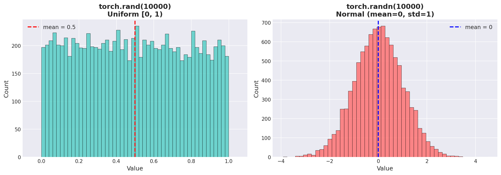
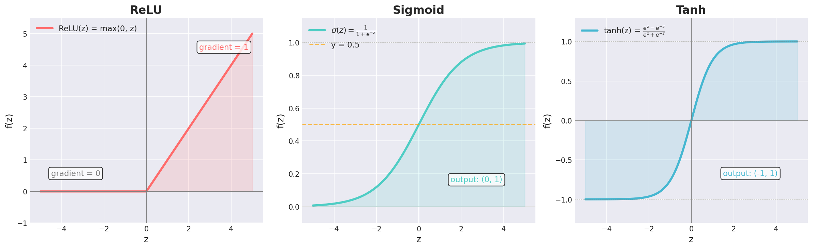
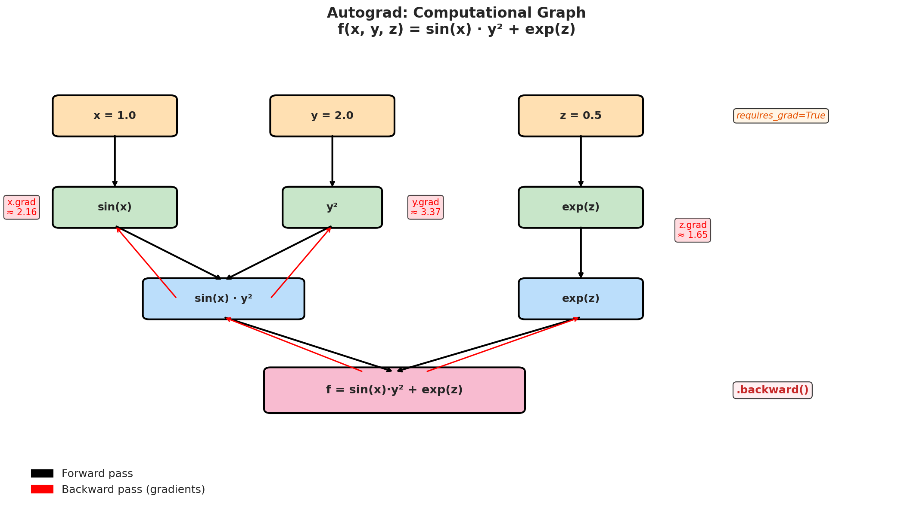
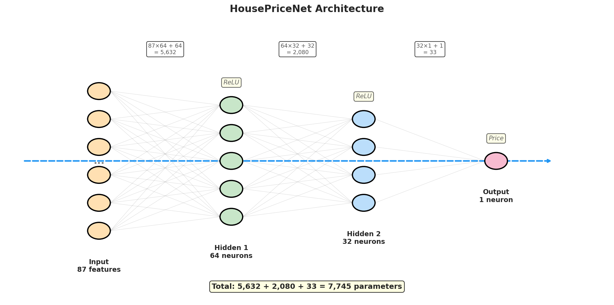
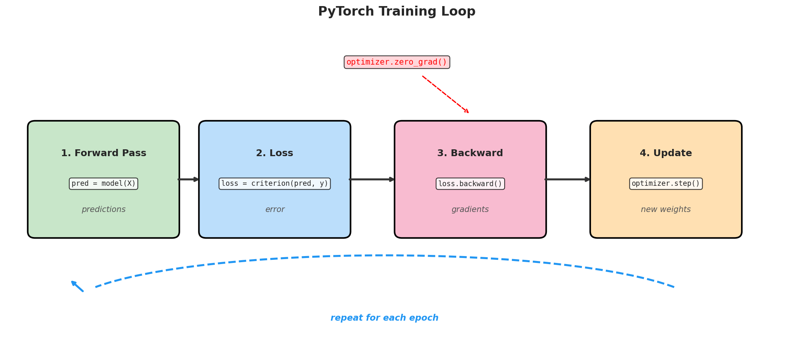
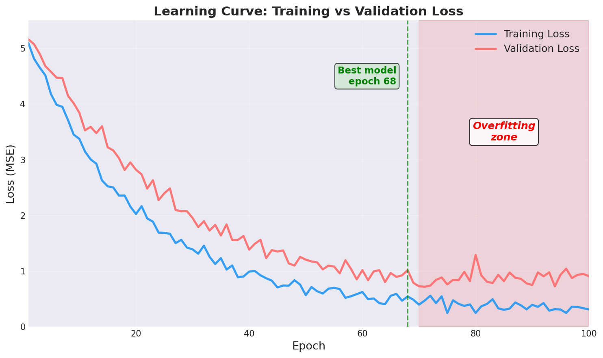

# Лекція 4. Основи PyTorch: від тензорів до нейронних мереж

**Курс:** Штучний інтелект в ігрових застосунках
**Спеціальність:** 121 — Інженерія програмного забезпечення

Національний університет "Львівська Політехніка"
Львів, 2026

---

## Мета лекції

Після цієї лекції ви будете:

1. Розуміти, що таке тензори і як представляти дані для нейромереж
2. Вміти виконувати основні тензорні операції у PyTorch
3. Розуміти, як autograd автоматично обчислює градієнти
4. Вміти побудувати та натренувати просту нейронну мережу
5. Знати універсальний шаблон тренувального циклу PyTorch

---

## Теми

1. Тензори: фундаментальна структура даних
2. Перетворення реальних даних у тензори
3. Тензорні операції та функції активації
4. Autograd: автоматичне диференціювання
5. Побудова нейронної мережі з `nn.Module`
6. Повний цикл тренування
7. Ігрові застосування

---

## Що таке PyTorch?

**PyTorch** — фреймворк глибокого навчання від Meta AI (Linux Foundation)

Три ключові можливості:
- **Тензори** — як NumPy масиви, але з підтримкою GPU
- **Autograd** — автоматичне обчислення градієнтів
- **nn.Module** — зручна побудова нейронних мереж

```python
import torch
import torch.nn as nn
```

**Стандарт індустрії:** використовується у дослідженнях (>70% статей) та продакшені

---

## Що таке тензор?

Узагальнення знайомих математичних об'єктів:

| Вимірів | Об'єкт | Приклад | Форма |
|---|---|---|---|
| 0 | Скаляр | Температура: 36.6 | `tensor(36.6)` |
| 1 | Вектор | Позиція NPC: [x, y, z] | `(3,)` |
| 2 | Матриця | Таблиця гравців | `(100, 5)` |
| 3 | 3D-тензор | RGB зображення | `(3, 224, 224)` |
| 4 | 4D-тензор | Батч зображень | `(32, 3, 224, 224)` |

**У лаб. роботі:** кожне зображення — тензор `(3, 224, 224)`

---

## Створення тензорів

```python
import torch

# Із конкретних значень
damage = torch.tensor([150.0, 200.0, 75.0, 300.0])

# Випадкові значення (рівномірний розподіл [0, 1))
weights = torch.rand(3, 4)

# Випадкові значення (нормальний розподіл, μ=0, σ=1)
noise = torch.randn(64, 128)

# Заповнені нулями/одиницями
zeros = torch.zeros(2, 3)
ones = torch.ones(5)
```

---

## Розподіли: rand() vs randn()



- `torch.rand()` — рівномірний на [0, 1) — для ініціалізації
- `torch.randn()` — нормальний біля 0 — для шуму та тестування

---

## Атрибути тензора

Кожен тензор має три ключові характеристики:

```python
t = torch.randn(3, 224, 224)

t.shape   # torch.Size([3, 224, 224]) — розмірності
t.dtype   # torch.float32 — тип даних
t.device  # cpu або cuda:0 — де зберігається
```

| Тип | Розмір | Використання |
|---|---|---|
| `float32` | 4 байти | Стандарт тренування |
| `float16` | 2 байти | Mixed precision (швидше) |
| `int64` | 8 байтів | Індекси, мітки класів |
| `bool` | 1 байт | Маски, фільтри |

---

## Реальні дані → тензори: таблиці

```python
# Статистики 6 персонажів: [рівень, сила, спритність, інтелект, HP]
characters = torch.tensor([
    [10, 25, 15, 8,  450],
    [15, 18, 22, 20, 380],
    [8,  30, 10, 5,  520],
    [20, 15, 25, 28, 350],
    [12, 22, 18, 12, 420],
    [5,  12, 8,  35, 280],
], dtype=torch.float32)

print(characters.shape)  # torch.Size([6, 5])
# 6 персонажів × 5 ознак
```

`dtype=torch.float32` — для gradient descent потрібні float!

---

## Реальні дані → тензори: нечислові

**Текст** — словник індексів:

```python
vocab = {"attack": 0, "defend": 1, "heal": 2, "dodge": 3}
actions = torch.tensor([0, 0, 2, 1])  # shape: (4,)
```

**Зображення** — сітка пікселів:

```python
grayscale = torch.rand(28, 28)       # shape: (28, 28)
color = torch.rand(3, 224, 224)      # shape: (3, 224, 224) — CHW!
```

**3D-моделі** — координати вершин:

```python
vertices = torch.rand(1000, 3)       # shape: (1000, 3) — xyz
```

> PyTorch зберігає зображення у форматі **CHW** (Channels, Height, Width)

---

## Тензорні операції: арифметика

```python
a = torch.tensor([1.0, 2.0, 3.0])
b = torch.tensor([4.0, 5.0, 6.0])

# Поелементне
c = a + b       # [5., 7., 9.]
d = a * b       # [4., 10., 18.]  (НЕ dot product!)

# Скалярний добуток
dot = torch.dot(a, b)  # 32. = 1×4 + 2×5 + 3×6

# Матричне множення — фундамент нейромереж!
W = torch.randn(3, 4)  # Матриця ваг
x = torch.randn(4)     # Вхід
y = W @ x               # Вихід = Wx
```

Оператор `@` → `y = W @ x + b` ← це і є $\hat{y} = \mathbf{W}\mathbf{x} + \mathbf{b}$

---

## Тензорні операції: агрегації

```python
scores = torch.tensor([85.0, 92.0, 78.0, 95.0, 88.0])

scores.sum()      # 438.0
scores.mean()     # 87.6
scores.max()      # 95.0
scores.min()      # 78.0
scores.std()      # 6.54
scores.argmax()   # 3 — ІНДЕКС максимуму!
```

**`argmax()`** — визначає передбачений клас у класифікації:

```python
logits = model(image)        # [0.1, 0.7, 0.2]
predicted_class = logits.argmax()  # 1 → "hardcore"
```

---

## Функції активації



```python
import torch.nn.functional as F
z = torch.tensor([-2.0, -1.0, 0.0, 1.0, 2.0])
F.relu(z)          # [0., 0., 0., 1., 2.]
torch.sigmoid(z)   # [0.12, 0.27, 0.50, 0.73, 0.88]
torch.tanh(z)      # [-0.96, -0.76, 0.00, 0.76, 0.96]
```

---

## Чому ReLU домінує?

**Без активації:** послідовність лінійних шарів = одна лінійна модель
$$W_2(W_1 x + b_1) + b_2 = W_{combined}x + b_{combined}$$

**З ReLU:** кожен шар вносить нелінійність

### Переваги ReLU:
- Обчислювально дешевий: `max(0, z)`
- Градієнт = 1 для z > 0 → **немає зникаючих градієнтів**
- Sigmoid/Tanh: градієнт → 0 для великих |z| → мережа перестає навчатися

### Використання:
| Функція | Де | Чому |
|---|---|---|
| ReLU | Приховані шари | Швидко, стабільно |
| Sigmoid | Вихід (бінарна класиф.) | Ймовірність (0, 1) |
| Softmax | Вихід (багатокласова) | Ймовірності, Σ = 1 |

---

## Autograd: навіщо?

З лекції 2: градієнтний спуск оновлює параметри:

$$\theta \leftarrow \theta - \alpha \cdot \nabla_\theta \mathcal{L}$$

- Лінійна регресія (2 параметри) → можна вручну
- Нейронна мережа (мільйони параметрів) → **неможливо вручну**

**Autograd** — система PyTorch для автоматичного обчислення всіх градієнтів

> Ви описуєте обчислення "вперед" → PyTorch автоматично виконує "назад"

---

## Autograd: простий приклад

```python
# f(x) = x²  →  df/dx = 2x
x = torch.tensor(2.0, requires_grad=True)  # Увімкнути!
f = x ** 2                                  # f = 4.0

f.backward()      # Обчислити df/dx
print(x.grad)     # tensor(4.) — бо 2×2 = 4 ✓
```

### Що відбувається:
1. `requires_grad=True` → PyTorch будує **обчислювальний граф**
2. `.backward()` → проходить граф у зворотному напрямку
3. `.grad` → зберігає обчислений градієнт

---

## Autograd: функція кількох змінних

$$f(x, y, z) = \sin(x) \cdot y^2 + e^z$$

```python
x = torch.tensor(1.0, requires_grad=True)
y = torch.tensor(2.0, requires_grad=True)
z = torch.tensor(0.5, requires_grad=True)

f = torch.sin(x) * y**2 + torch.exp(z)
f.backward()

print(x.grad)  # ∂f/∂x = cos(x)·y² ≈ 2.16
print(y.grad)  # ∂f/∂y = sin(x)·2y  ≈ 3.37
print(z.grad)  # ∂f/∂z = eᶻ         ≈ 1.65
```

PyTorch обчислив **всі 3 часткові похідні автоматично!**

---

## Обчислювальний граф



Autograd будує граф операцій і проходить його назад для обчислення градієнтів

---

## nn.Module: побудова мережі

Кожна нейронна мережа — клас, що наслідує `nn.Module`:

```python
import torch.nn as nn

class HousePriceNet(nn.Module):
    def __init__(self):
        super().__init__()
        self.layer1 = nn.Linear(87, 64)   # 87 → 64
        self.layer2 = nn.Linear(64, 32)   # 64 → 32
        self.layer3 = nn.Linear(32, 1)    # 32 → 1 (ціна)
        self.relu = nn.ReLU()

    def forward(self, x):
        x = self.relu(self.layer1(x))
        x = self.relu(self.layer2(x))
        x = self.layer3(x)  # Без активації!
        return x

model = HousePriceNet()
```

---

## Що всередині nn.Linear?

`nn.Linear(in, out)` реалізує: $\mathbf{y} = \mathbf{W}\mathbf{x} + \mathbf{b}$

```python
model.layer1.weight.shape  # torch.Size([64, 87])
model.layer1.bias.shape    # torch.Size([64])

# Загальна кількість параметрів
total = sum(p.numel() for p in model.parameters())
print(total)  # 7 777
```

**Вихідний шар без активації** — для регресії потрібне необмежене число

Для класифікації додали б:
- `sigmoid` → бінарна (2 класи)
- `softmax` → багатокласова (>2 класів)

---

## Архітектура мережі



Мережа "звужується": 87 → 64 → 32 → 1 — стискає інформацію до передбачення

---

## Підготовка даних

```python
from sklearn.model_selection import train_test_split
from sklearn.preprocessing import StandardScaler

# 1. Розбиття 80/20
X_train, X_test, y_train, y_test = train_test_split(
    features, targets, test_size=0.2)

# 2. Нормалізація (КРИТИЧНО!)
scaler = StandardScaler()
X_train = scaler.fit_transform(X_train)   # fit + transform
X_test = scaler.transform(X_test)          # тільки transform!

# 3. Конвертація в тензори
X_train = torch.tensor(X_train, dtype=torch.float32)
y_train = torch.tensor(y_train, dtype=torch.float32).unsqueeze(1)
```

**Чому нормалізація?** Без неї площа (50–300) домінує над кімнатами (1–5)

---

## Компоненти тренування

```python
model = HousePriceNet()
criterion = nn.MSELoss()            # Функція втрат
optimizer = torch.optim.Adam(model.parameters(), lr=0.01)
```

| Компонент | Роль | Для регресії | Для класифікації |
|---|---|---|---|
| Модель | Передбачення | HousePriceNet | PlayerClassifier |
| Criterion | Міра помилки | `MSELoss` | `CrossEntropyLoss` |
| Optimizer | Оновлення ваг | Adam (lr=0.01) | Adam / SGD |

**Adam** — вдосконалений SGD з адаптивним learning rate для кожного параметра

---

## Цикл тренування: 4 кроки

```python
for epoch in range(100):
    # 1. Forward pass
    predictions = model(X_train)

    # 2. Обчислення втрат
    loss = criterion(predictions, y_train)

    # 3. Backward pass
    optimizer.zero_grad()   # Обнулити градієнти!
    loss.backward()         # Обчислити ∂L/∂w

    # 4. Оновити ваги
    optimizer.step()        # w ← w - α·∇L
```

**`zero_grad()`** — PyTorch накопичує градієнти! Забудете → модель не навчиться

---

## Цикл тренування: діаграма



**forward → loss → backward → step** — універсальний шаблон для БУДЬ-ЯКОЇ моделі

---

## Оцінка моделі

```python
model.eval()                    # Режим оцінки

with torch.no_grad():           # Вимкнути autograd
    test_pred = model(X_test)
    test_loss = criterion(test_pred, y_test)
    mae = torch.mean(torch.abs(test_pred - y_test))

print(f"Test MSE: {test_loss.item():.2f}")
print(f"Test MAE: £{mae.item():.0f}")
```

### Два важливих моменти:
- **`model.eval()`** — впливає на dropout, batch norm
- **`torch.no_grad()`** — економить пам'ять і час (не будує граф)

---

## Крива навчання



Training loss ↓ + Validation loss ↑ = **перенавчання (overfitting)**

---

## Якість даних > складність моделі

**Типова помилка:** більше шарів = кращий результат?

**Реальність:** 3 хороші ознаки > 100 неінформативних + складна мережа

### Правило "Garbage In — Garbage Out":

1. Дані чисті? (пропуски, помилки, дублікати)
2. Ознаки інформативні? (зв'язок з target)
3. Достатньо даних для складності моделі?

> Перш ніж ускладнювати модель — покращте дані!

---

## Ігрове застосування: балансування шкоди

```python
class DamagePredictor(nn.Module):
    def __init__(self):
        super().__init__()
        self.net = nn.Sequential(
            nn.Linear(8, 32),   # рівень, сила, зброя...
            nn.ReLU(),
            nn.Linear(32, 16),
            nn.ReLU(),
            nn.Linear(16, 1)    # → передбачена шкода
        )

    def forward(self, x):
        return self.net(x)
```

`nn.Sequential` — зручний спосіб для простих мереж без розгалужень

---

## Ігрове застосування: класифікація гравців

```python
class PlayerClassifier(nn.Module):
    def __init__(self):
        super().__init__()
        self.net = nn.Sequential(
            nn.Linear(12, 32),  # 12 метрик поведінки
            nn.ReLU(),
            nn.Linear(32, 3)   # 3 типи: casual/hardcore/social
        )

    def forward(self, x):
        return self.net(x)

criterion = nn.CrossEntropyLoss()  # Вже включає softmax!
```

Вихідний шар: стільки нейронів = скільки класів

---

## Зв'язок з лабораторними роботами

| Концепція лекції | У лабораторній роботі |
|---|---|
| Тензори | Зображення `(3, 224, 224)` |
| Нормалізація | `transforms.Normalize()` |
| `nn.Module` | `models.resnet18()` |
| Цикл тренування | Fine-tuning ResNet-18 |
| `model.eval()` | Інференс та Grad-CAM |
| `CrossEntropyLoss` | Функція втрат |
| `Adam` / `SGD` | Оптимізатор |

Різниця лише у **складності моделі** (3 шари vs 18 шарів, ~11.7M параметрів)

Принцип тренування **абсолютно однаковий**: forward → loss → backward → step

---

## Підсумок

1. **Тензори** — універсальний контейнер: числа, зображення, текст, 3D
2. **Операції** — арифметика, агрегації, активації — блоки нейромереж
3. **Autograd** — автоматичне диференціювання (`requires_grad` + `.backward()`)
4. **nn.Module** — ООП-спосіб побудови архітектур
5. **Цикл тренування** — forward → loss → backward → step
6. **Якість даних** — важливіша за складність моделі

### Наступна лекція:
Нейронні мережі в деталях: backpropagation, dropout, batch normalization

---

## Запитання?

<br/>
<br/>

### Контакти

Лектор: Бауск О.Є., к.т.н., асистент кафедри ПЗ

### Корисні посилання:

- PyTorch: https://pytorch.org/docs/
- PyTorch tutorials: https://pytorch.org/tutorials/
- torchvision: https://pytorch.org/vision/
